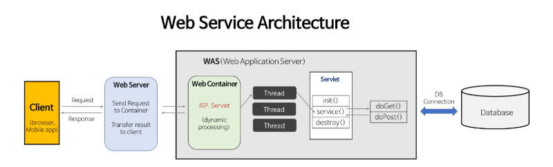

## 🎯핵심 키워드

---
### 1. IP
IP(Internet Protocol) 주소란 인터넷에 연결된 기기를 식별하는 값을 뜻한다. 예를 들어 우편번호가 특정 장소를 가리키듯이, IP 주소는 인터넷에 연결된 특정 기기를 가리킴. 컴퓨터, 스마트폰 등각각의 기기는 인터넷으로 서로 통신하고 데이터를 교환하는데 우편번호가 있어야 편지를 전달하듯이, IP 주소를 통해 기계가 서로 통신할 수 있다.

한 마디로 요약하자면 **IP 주소는 인터넷 통신을 가능하게 하는 국제 표준 규약,** 각 장치에 고유한 IP 주소를 할당하여 네트워크에서 장치를 식별하고 데이터를 전송

IP 주소의 역할

⇒ 인터넷은 수십억 개의 기계를 연결한 거대한 네트워크 시스템으로 이때 인터넷 통신은 데이터를 패킷으로 나누어 전송해요. 데이터를 수신하는 호스트는 나누어진 패킷을 다시 조립해서 데이터를 원상태로 복구

이러한 패킷 간 통신 과정에서는 IP 라우팅이 필요하다

**라우팅: 수 많은 인터넷 네트워크에서 패킷을 효율적으로 전달할 수 있는 경로를 찾는 것**

IP가 통신 규약이라면, IP 주소는 통신을 가능하게 하는 필수 요소.

IP 주소는 각 기계의 고유 주소로 인터넷 통신 과정에서 데이터 패킷의 수신, 발신 호스트를 식별하는 역할을 한다.

### 2. PORT
어떤 프로세스에서 데이터를 받을지를 알아야하는데 이때 쓰이는것이 포트 번호

이것을 좀 더 자세하게 알아보면 네트워크 상에서 통신을 할 때는 위에 나온 IP를 토대로 해당 서버가 있는 컴퓨터에 접근할 수 있는데 요즘 대부분의 경우는 하나의 컴퓨터에 여러 개의 서버가 실행될 수 있다. 컴퓨터에 여러 개의 서버가 실행되고 있다면, 어느 서버에 접속해야 하는지 컴퓨터에게 알려주어야 한다.

(밑에 예시가 가장 쉽게 이해가 돼서 예시 첨부)

예를 들어 컴퓨터에 카카오톡, 라인, Slack 채팅서버 앱 메세지 프로세스가 여러개 실행 중이라고 해보자. 컴퓨터가 메세지를 받았을 때 모든 프로세스에서 메세지를 전송하고 받을수 있는 앱들인데, 이렇게 된다면 어떤 프로그램으로 해당 메세지를 전송해야 할까? 만약 아무런 정보가 없다면 어떤 프로세스로 메세지를 보내야 하는지 알 수 없다. 이를 해결하기 위해 TCP에서는 패킷에 어떤 프로세스가 받아야 하는지에 대한 정보를 추가하여 보내는데, 이때 보내는 정보가 바로 포트 정보이다.

사진에서 예시를 살펴보면 IP 주소는 같고 각각의 앱의 포트 번호가 다른것을 볼 수 있는데 aaa.aaa.aaa.aaa라는 IP 주소는 해당 서버(윈도우 노드)를 식별하는 데 사용하기 때문에 같은 서버라면 IP주소는 모두 같게 된다.

그렇기에 서버에서 특정 앱이나 서비스를 식별할때는 포트 번호를 사용하게 되는데 메시지가 서버로 들어오면, 데이터 패킷에 포함된 포트 번호를 확인하여 해당 메시지를 어떤 애플리케이션으로 전달해야 하는지 결정한다.

따라서 같은 IP 주소를 가진 서버 내에서 여러 애플리케이션이 동시에 실행되면서 메시지를 어떤 앱으로 보내야하는지도 구별할 수 있다.

### 3. CIDR
CIDR이란 무엇일까? 우선 AWS에 나와있는 CIDR의 정의를 살펴본다면

- Classless Inter-Domain Routing(CIDR)은 인터넷상의 데이터 라우팅 효율성을 향상시키는 IP 주소 할당 방법입니다. 인터넷에 연결되는 모든 컴퓨터, 서버 및 최종 사용자 디바이스에는 IP 주소라는 고유한 번호가 연결되어 있습니다. 디바이스는 이러한 IP 주소를 사용하여 서로 찾고 통신합니다. 조직에서는 CIDR을 사용하여 네트워크에 유연하고 효율적으로 IP 주소를 할당합니다.

라고 나와있다.

이걸 조금 더 쉽게 설명하고 싶어서 알아본 결과

- CIDR은 **클래스 없는 도메인 간 라우팅 기법**으로, IP 주소를 더 유연하고 효율적으로 사용하도록 설계된 방식으로, 기존의 고정된 IP 클래스(A, B, C)를 따르지 않고, 필요에 따라 IP 주소 대역을 자유롭게 쪼개거나 합칠 수 있다. 정도로 설명하고싶다.

또한 CIDR 방식은 **IP 주소 낭비를 최소화**하고, **인터넷 라우팅 테이블 크기를 줄여서 성능을 향상**시키는 데 큰 역할을 한다.

기존에는 고정된 IP 클래스를 따른다고 했는데 기존 IP 주소는 원래 **클래스 A, B, C**로 나뉘었고, 각 클래스는 고정된 범위를 가지고 있었음.

- **클래스 A:** `0.0.0.0 ~ 127.255.255.255` (약 16,777,214개 IP)  → **너무 큼**

.       작은 회사나 기관이 사용하기엔 불필요하게 큰 대역.

- **클래스 B:** `128.0.0.0 ~ 191.255.255.255` (약 65,534개 IP)  → **중간 크기**.

       하지만 이정도의 IP 범위도 중소기업 및 작은 기관한테는 불필요하게 큼

- **클래스 C:** `192.0.0.0 ~ 223.255.255.255` (254개 IP) → **너무 작음**

        IP 300개 이상이 필요한 회사라면 클래스 C 하나로는 부족.

이러한 문제를 해결하기 위해 CIDR을 이용하여 IP 주소를 고정된 클래스에 묶지 않고, **IP 주소와 서브넷 마스크**를 조합해 필요한 만큼만 IP를 나눈다.

이렇게 말하니깐 좀 헷갈려서  **IP 주소와 서브넷 마스크를 예시로 들어 설명하자면**

IP 주소: 192.168.10.0/26 (예시) ⇒ 장치에 할당된 고유한 주소

서브넷 마스크: 255.255.255.192 (예시) ⇒ 네트워크와 호스트를 구분하는 기준

다음 예시의 IP 주소를 이진수로 표현한다면 **11000000.10101000.00001010.00000000**으로 표현 가능하고**,** 예시의 서브넷 마스크를 이진수로 표현하다면 **11111111.11111111.11111111.11000000**으로 표현 할 수 있다.

현재 CIDR이 "/26" 이기 때문에 앞에서부터 24비트 이후에 오는 4번째 옥텟의 3번째 비트부터 마지막 비트까지  사용할 수 있다. (위 사진은 비트 수를 쉽게 살펴보기 위해 가져온 사진으로 내가 예시를 든 IP Address와 다르다)

때문에 첫번째 주소와 마지막 주소인 네트워크 주소와 브로드캐스트 주소를 제외하고 사용할수 있는 IP 주소의 범위 192.168.10.1 ~ 192.168.10.62까지이다.

또한 CIDR은 IP클래스에 국한되지 않고 더욱더 IP 주소를 쪼개는 방식인 서브네팅과 여러 개의 네트워크 대역을 하나로 합칠 수 있는 슈퍼네팅을 모두 포함한다.

#### CIDR의 장점

- **IP 낭비 최소화:** 필요한 IP만큼만 할당해서 효율적으로 사용.
- **라우팅 테이블 간소화:** 여러 네트워크 대역을 하나로 묶어 라우팅 경로 줄임.
- **유연한 IP 관리:** 작은 네트워크, 큰 네트워크 상황에 맞게 대역을 유동적으로 조절.
- **정확한 IP 할당:** 필요한 만큼의 IP 주소를 정확히 할당할 수 있어 주소 낭비를 최소화.
- **유연한 서브넷 크기:** 가변 길이 서브넷 마스크를 사용하여 네트워크 요구사항에 맞는 크기의 서브넷을 생성할 수 있음.
- **IPv4 주소 고갈 문제 해결:** 효율적인 주소 할당으로 IPv4 주소 고갈 속도를 늦춤
- **라우팅 효율성 개선:** 라우트 집계를 통해 라우팅 테이블 크기를 줄여 데이터 패킷 라우팅 속도를 향상
- **트래픽 관리 최적화:** 호스트 요구사항에 맞게 조정된 서브넷을 통해 트래픽 흐름과 데이터 라우팅을 최적화

### 5. TCP와 UDP 차이
우선 두개의 차이점을 알아보기전에 TCP, UDP가 뭔지 살펴보면

### TCP

신뢰성 있는 데이터 전송을 지원하는 연결 지향형 프로토콜로 데이터의 전달을 보장한다.

즉 패킷이 손실되거나 순서가 바뀐다면 TCP는 이를 해결하여 오류 없는 데이터 전송을 보장함.

- 이와 같은 특성으로 TCP는 웹 브라우징, 이메일 전송, 파일 다운로드와 같이 신뢰성이 필요한 에플리케이션에 주로 사용.
- 신뢰성을 보장하기 위해 3 way handshake 를 하게되는데 이러한 신뢰성 처리시간이 더 많이 필요해서 UDP보다 상대적으로 느림.

### UDP

연결이 없는 프로토콜로 데이터 전송을 시작하기 전에 목적지와의 연결을 설정하기 않기 때문에 데이터 전달을 보장하지 않음.

즉 패킷이 손실되거나 순서가 바뀌어도 자동으로 해결해주지 않는다.

- 따라서 UDP는 속도가 중요한 실시간 애플리케이션( 음성채팅, 실시간 스트리밍, 온라인 게임 등 ) 에서 사용됩니다. 이러한 애플리케이션은 데이터 패킷의 일시적 손상보다 빠른 전송 속도가 중요하기 때문에 UDP 방식을 사용
- TCP에 비해 시간이 적게 필요하므로 UDP는 상대적으로 빠르다.

  
해당 사진: OSI 7layer와 TCP/IP 4layer
  

 
해당 사진: TCP와 UDP의 데이터 전송 방식의 차이

### [ TCP 특징 ]

- 연결 지향 방식으로 패킷 교환 방식을 사용한다(가상 회선 방식이 아님).
- 3-way handshaking과정을 통해 연결을 설정하고 4-way handshaking을 통해 해제한다.
- 흐름 제어 및 혼잡 제어.
- 높은 신뢰성을 보장한다.
- UDP보다 속도가 느리다.
- 전이중(Full-Duplex), 점대점(Point to Point) 방식.

### [ UDP 특징 ]

- 비연결형 서비스로 데이터그램 방식을 제공한다
- 정보를 주고 받을 때 정보를 보내거나 받는다는 신호절차를 거치지 않는다.
- UDP헤더의 CheckSum 필드를 통해 최소한의 오류만 검출한다.
- 신뢰성이 낮다
- TCP보다 속도가 빠르다

| **프로토콜 종류** | **TCP** | **UDP** |
| --- | --- | --- |
| 연결 방식 | 연결형 서비스 | 비연결형 서비스 |
| 전송 순서 | 전송 순서 보장 | 전송 순서 보장 X |
| 수신 여부 확인 | 수신 여부 확인 | 수신 여부 확인 X |
| 통신 방식 | 1:1 통신 | 1:1 or 1:N or N:N 통신 |
| 신뢰성 | 높음 | 낮음 |
| 속도 | 빠르다 | 느리다  |

### 6. Web Server와 WAS의 차이
### Web Server

작성된 html페이지 등을 네트워크망에 종속되지 않고, 웹서비스를 할 수 있도록 어플리케이션으로 **정적 콘텐츠를 처리하는 서버**이다.

HTTP 프로토콜을 기반으로 클라이언트의 요청을 처리하고, HTML, CSS, 이미지 등 정적 파일을 제공함. **클라이언트의 요청을 WAS로 전달**하고, WAS의 처리 결과를 클라이언트에게 전송

### WAS (Web Application Server)

웹 애플리케이션을 실행하고, 클라이언트와의 요청과 응답을 처리하는 서버로, 웹 애플리케이션의 **비즈니스 로직**을 처리하고, **데이터베이스와의 상호작용**을 통해 동적인 웹 페이지를 생성하여 클라이언트에 전달한다.

### **Web Server와 WAS의 주요 차이점**

1. **처리하는 콘텐츠 유형**
  - Web Server: 정적 콘텐츠
  - WAS: 동적 콘텐츠 (+ 정적 콘텐츠도 처리 가능)
2. **기능의 범위**
  - Web Server: 파일 경로 이름을 받아 경로와 일치하는 파일 콘텐츠를 반환
  - WAS: 요청에 맞는 데이터를 DB에서 가져와 비즈니스 로직에 따라 동적으로 결과를 생성
3. **자원 이용의 효율성**
  - Web Server: 정적 콘텐츠 처리에 특화되어 있어 해당 기능에 대해 높은 효율성을 보임
  - WAS: 동적 콘텐츠 처리에 특화되어 있으나, 정적 콘텐츠 처리 시 Web Server보다 효율성이 떨어질 수 있음
4. **보안**
  - Web Server: 상대적으로 간단한 보안 기능 제공
  - WAS: 더 복잡하고 다양한 보안 기능 제공 가능
5. **플러그인과 모듈**
  - Web Server: 다양한 플러그인과 모듈을 통해 기능 확장 가능
  - WAS: 주로 자체적인 기능에 의존하며, 애플리케이션 로직에 초점

이렇게만 본다면 사실 WAS만으로 Web Server를 모두 처리할 수 있고 Web Server가 WAS에 속해있는 개념인데 왜 굳이 Web Server 자체를 아직도 따로 사용하고 있는걸까?

### **Web Server와 WAS를 함께 사용하는 이유**

1. **기능 분배를 통한 서버 부하 감소**
  - Web Server가 정적 콘텐츠를 처리하여 WAS의 부하를 줄임
2. **보안 강화**
  - Web Server를 앞단에 두어 추가적인 보안 계층 제공
3. **여러 대의 WAS 연결 가능**
  - 로드 밸런싱과 장애 극복 기능 구현 용이
4. **유지보수의 편의성**
  - WAS의 재시작 시에도 Web Server를 통해 사용자에게 오류 페이지 제공 가능

