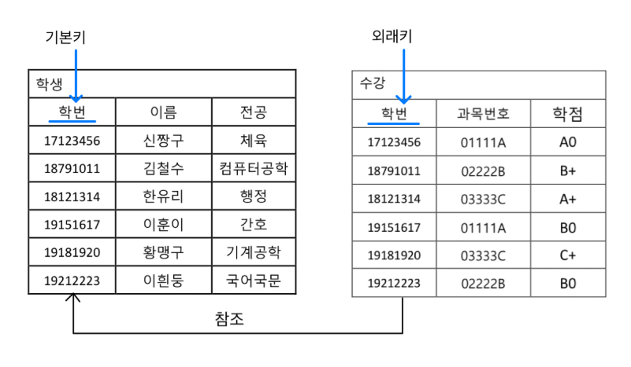
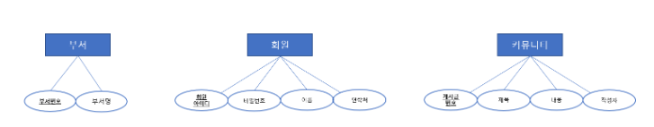
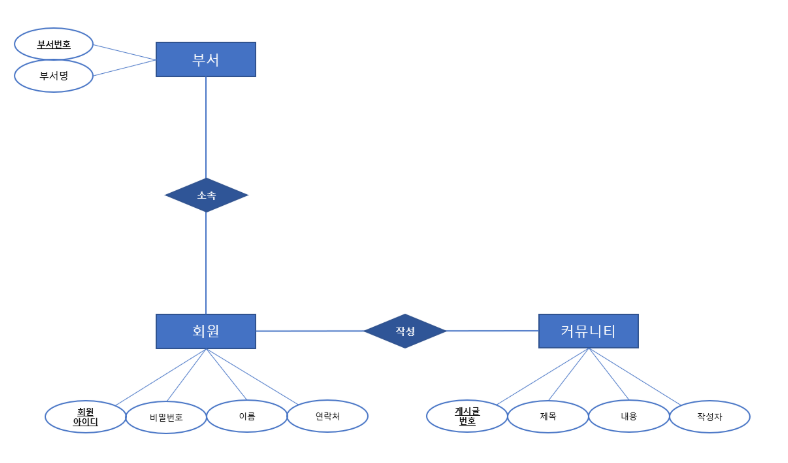
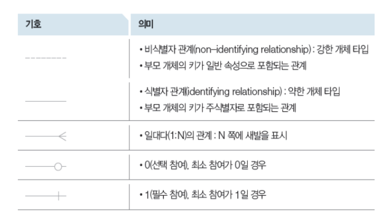
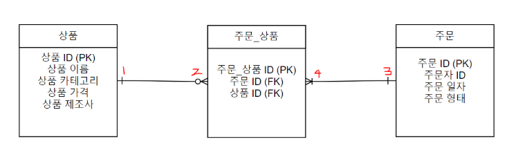
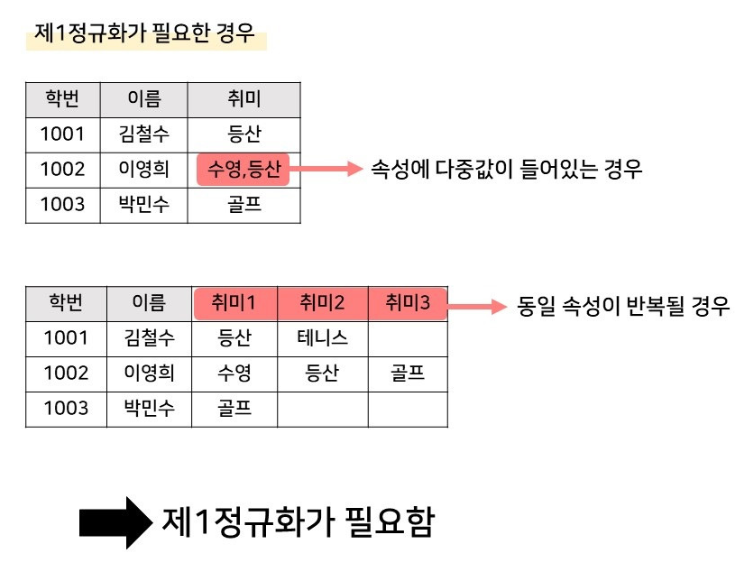
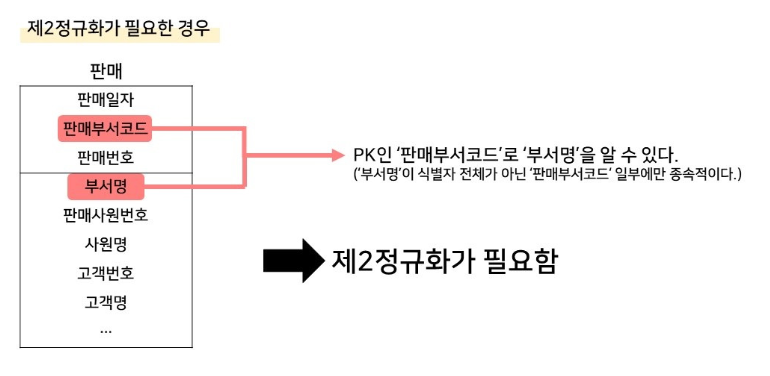
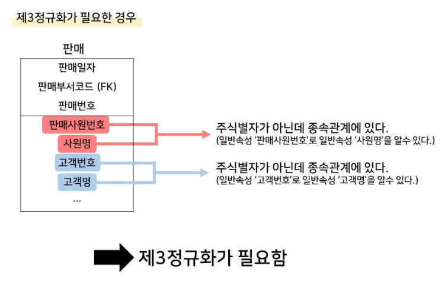
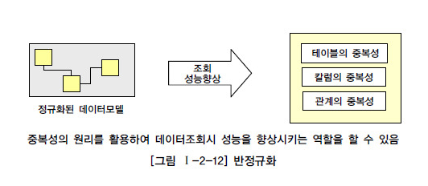

## 🎯핵심 키워드

---


## 외래키
외래키(FK)는 데이터가 일관될 수 있도록 **돕는 역할**을 한다. 보통은 두 개의 데이터베이스 테이블을 잇고자 기본 키와 함께 사용된다. 일종의 테이블을 **연결**하는 가상의 다리 역할을 한다.

한 테이블의 컬럼이 **다른 테이블의 기본키(PK)를 참조하는 키**를 의미함.

즉, 테이블 간의 관계(Relationship)를 정의하는데 사용

⇒ 외래 키를 생성하기 전, 기본 키를 먼저 정의해야 함.

### 외래키의 특징

1. **참조 무결성(Referential Integrity)**
    - 외래키 값은 **반드시 참조하는 테이블(PK 테이블)의 기본키 값 중 하나여야 함.**
    - 존재하지 않는 기본키 값을 외래키로 설정할 수 없음.
2. **NULL 허용 가능 (상황에 따라 다름)**
    - 특정 데이터가 관계를 가지지 않을 수도 있기 때문에, 외래키 컬럼은 **NULL 값을 가질 수도 있다.**
    - 하지만 외래키가 반드시 특정 데이터를 가리켜야 한다면 `NOT NULL`로 설정해야 함.
3. **삭제 및 업데이트 제약조건 (CASCADE, SET NULL 등)**
    - **ON DELETE CASCADE** : 참조된 기본키가 삭제될 경우, 외래키를 가진 행도 함께 삭제
    - **ON DELETE SET NULL** : 참조된 기본키가 삭제되면, 외래키 값을 NULL로 설정
    - **ON DELETE RESTRICT** : 기본키가 참조되고 있을 경우 삭제를 막는다.


이러한 외래키의 특징을 통해 외래키 선정의 몇가지 조건을 살펴본다면

- 외래 키는 관계를 표현한다.
- 외래 키는 기본 키와 다르게 하나의 테이블에 여러 개를 지정 할 수 있다.
- 외래 키는 NULL값과 중복 값이 허용된다.
- 참조되는 값이 변경되면 참조하는 값도 변경된다.
- 외래 키는 기본 키의 일부가 될 수 있다.

등이 있다.

FK의 생성을 간단하게 예를 들어보겠다.

```sql
CREATE TABLE Post (
    post_id INT PRIMARY KEY, 
    title VARCHAR(255), 
    user_id INT,
    FOREIGN KEY (user_id) REFERENCES User(user_id) ON DELETE CASCADE
);
```

FOREIGN KEY (user_id) REFERENCES User(user_id) → Post.user_id는 User.user_id를 참조하는 외래키(FK)
ON DELETE CASCADE 옵션을 설정했기 때문에, User 테이블에서 user_id가 삭제되면 해당 사용자의 모든 Post도 삭제

이러한 외래키는 기본키와 반드시 함께 사용해야하는데 외래키와 기본키를 함께 사용하는 이유는

- **데이터의 무결성 보장**
    - 기본키(PK)와 외래키(FK)를 설정하면 데이터베이스가 **잘못된 데이터 삽입/삭제를 방지**할 수 있다.
- **관계 설정을 통해 효율적인 데이터 관리**
    - 테이블 간의 관계를 명확하게 정의하면, **JOIN을 활용한 데이터 조회**가 가능해지고 성능이 향상된다.
- **데이터 일관성 유지**
    - `ON DELETE CASCADE`, `ON UPDATE CASCADE` 등을 활용하면, 부모 테이블(`User`)의 변경 사항이 자동으로 반영된다.

  등이 있다.

## 기본키
기본키(PK)는 데이터베이스 테이블 내의 모든 레코드에서 **고유한 아이디**를 제공한다.

쉽게말하면 테이블에서 각 행을 **유일하게 식별**할 수 있는 컬럼(또는 컬럼의 조합)

이러한 PK의 생성을 아주 간단한 예를 들어 설명한다면
```sql
CREATE TABLE User (
    user_id INT PRIMARY KEY,  // 현재 user_id를 PK로 지정 
    username VARCHAR(100), 
    email VARCHAR(255)
);
```
- 기본키를 설정해두면 해당 컬럼에 중복값을 INSERT하려고 할때 작동하지 않음.
- PK로 사용하기를 원하는 컬럼에 **PRIMARY KEY** 붙여준다. (단, 이 때 기본키의 값을 가진 컬럼은 중복값과 NULL값이 없어야 한다.)

### 기본키의 특징

1. **유일성(Unique)**
    - 한 테이블 내에서 같은 기본키 값을 가진 두 개의 행(row)은 존재할 수 없다.
    - 즉, **중복을 허용하지 않음.**
2. **NOT NULL (널 허용 X)**
    - 기본키 컬럼은 반드시 값이 존재해야 한다.
    - 즉, **NULL 값을 가질 수 없음.**
3. **변하지 않는 값 (Immutable)**
    - 기본키 값은 한 번 설정되면 변경되지 않는 것이 좋다..
    - 기본키 값이 변경되면 다른 테이블의 관계에도 영향을 줄 수 있기 때문
4. **단일 또는 복합 컬럼 가능**
    - 기본키는 **한 개의 컬럼**으로 구성될 수도 있고, **여러 개의 컬럼(복합키, Composite Key)**으로 구성될 수도 있음.

이러한 특징을 통해 기본키 선정의 몇가지 조건을 살펴본다면

- 테이블은 오직 하나의 Primary key값을 가진다.
- NULL값을 허용하지 않는다.
- 값의 중복이 없어야 한다.
- 키 값이 변하지 않아야 한다.
- 최대한 적은 수의 속성을 가진 것이 좋다.

등의 조건이 있다.

 <br>
해당사진: 기본키와 외래키

## ER 다이어그램
ER 다이어그램(ERD)란 데이터베이스 구조를 한 눈에 알아보기 위해 그려놓는 다이어그램이다.

이것은 ERD란 단어에서 의미하는 그대로 'Entity =개체' 와 'Relationship =관계'를 중점적으로 표시하는 ‘Diagram = 다이어그램’으로 구체화 하는 것을 말한다.

그렇다면 이런 ERD의 표시법은 어떻게 될까 살펴보면

1) 개체 (Entity)

- 개체란 단독으로 존재하는 객체를 의미하며, 동일한 객체는 존재하지 않는다.
- ERD에서는 개체를 "사각형"으로 표기한다.> 데이터베이스를 설계할 때, '테이블'이 Entity로 정의될 수 있다

**사진) ERD로 표현한 개체** <br>
 <br>
2) 속성 (Attribute)

- 속성은 개체가 가지고 있는 속성을 의미한다.
- ERD에서는 속성을 "원"으로 표기한다.
- 속성 중 "기본키"는 속성에 밑줄을 그어 표기한다.

**사진) ERD로 표현한 속성** <br>
 <br>
3) 관계 (Relationship)

- 관계는 개체 간의 관계를 의미한다.
- ERD에선 개체를 서로 이으며 어떤 관계를 가지는지 "마름모"로 표기한다.

**사진) ERD로 표현한 관계** <br>
 <br>
이러한 ERD는 개체간의 관계를 표현하는 표기법이 존재하는데 표기법에는 피터 첸 표기법(Peter Chen Notation), I/E 표기법(Information Engineering Notation), Baker 표기법 등 다양한 표기법이 있지만 가장 흔히 사용하는 I/E 표기법에 대해서 간단하게 설명하면
 <br>
위 사진을 참고하여 예시를 살펴보겠다. <br>
 <br>
우선 하나의 상품은 여러 주문에 포함이 될 수 있기 때문에 주문_상품 테이블과 **1대다**로 연결된다.

마찬가지로 하나의 주문은 여러개의 상품을 포함할 수 있기 때문에 주문_상품 테이블과 **1대다**로 연결된다.

1 : 하지만 하나의 주문_상품이 존재한다면 상품은 반드시 하나가 있어야한다.(최소 참여가 1 + 오직 한개만 대응)

2 : 그리고 하나의 상품에 대해서 관련있는 주문이 하나도 없을수도 있다.(최소 참여가 0)

3 : 그리고 하나의 주문_상품이 존재한다면 주문은 반드시 하나가 있어야한다.(최소 참여가 1 + 오직 한개만 대응)

4 : 하나의 주문에 대해서 관련있는 상품이 하나도 없을수는 없다. (최소참여가 1)

## 복합 키
**복합키 (Composite Key)** 또는 **복합 기본키**는 두 개 이상의 칼럼으로 구성된 기본키를 의미한다. 이러한 키는 데이터베이스 테이블 내에서 레코드의 고유성을 보장하기 위해 사용된다.

때로는 하나의 칼럼만으로는 레코드의 고유성을 보장하기 어려울 때, 두 개 이상의 칼럼을 결합하여 고유한 키 값을 생성함.

⇒ 기본키가 만약 복합키라면, 복합키 또한 당연히 유일성과 최소성을 만족해야함.

### 복합키(Composite Key)의 장점과 단점

**장점**

1. **데이터 중복 방지**
    - 예제처럼 **같은 학생이 같은 과목을 중복 신청하는 것을 방지**할 수 있음.
2. **관계형 데이터의 무결성 유지**
    - 외래키(FK)로 활용될 때, 여러 개의 컬럼을 기준으로 관계를 형성할 수 있음.
3. **단순한 ID 사용 없이 의미 있는 키 구성 가능**
    - 예를 들어, `Order` 테이블에서 (`user_id`, `product_id`) 조합을 사용하여 주문을 구별할 수 있음.
4. **정규화**: 복합키는 데이터베이스 설계의 정규화 과정에서 발생하는 테이블 간의 관계를 나타내는 데 유용하게 사용됨.

**단점**

1. **JOIN 연산이 복잡해짐**
    - 테이블을 조인할 때 **여러 개의 컬럼을 비교해야 하므로 성능 저하 발생 가능**
2. **인덱싱 최적화 필요**
    - 복합키를 사용할 경우 **인덱스를 여러 개의 컬럼에 걸어야 하므로 성능에 영향을 미칠 수 있음**
    - 특히, **한 개의 컬럼만으로 검색하는 경우 인덱스 활용이 어려울 수 있음**

## 연관관계
연관관계(Association)란 **두 개 이상의 개체(Entity) 간의 관계를 의미**하며,

관계형 데이터베이스(RDB)에서 **테이블 간의 관계를 나타낼 때** 사용된다.

- 연관관계를 통해 **하나의 테이블에서 다른 테이블의 데이터를 참조**할 수 있음
- 주로 **외래키(FK)**를 사용하여 관계를 설정
- 연관관계는 **1:1(일대일), 1:N(일대다), N:M(다대다) 관계**로 분류

그렇다면 이러한 연관관계에 대해서 하나씩 자세하게 알아본다면

### **1:1 (One-to-One) 관계**

- **한 테이블의 한 레코드가 다른 테이블의 한 레코드와만 연결**되는 관계
- **주로 사용자와 상세 정보 같은 관계에서 사용됨**

**예시: 사용자(User)와 사용자 프로필(UserProfile)**

- 한 명의 사용자(User)는 하나의 프로필(Profile)을 가짐
- 프로필(Profile)도 하나의 사용자(User)와만 연결됨

### **1:N (One-to-Many) 관계**

- **한 개의 레코드가 여러 개의 레코드와 연결되는 관계**
- **가장 일반적인 관계 유형**

**예시: 고객(Customer)과 주문(Order)**

- 한 명의 고객(Customer)은  **여러 개의 주문(Order)**을 할 수 있음
- 한 개의 주문(Order)은 **하나의 고객(Customer)에게 속함**

### **N:M (Many-to-Many) 관계**

- **한 개체(Entity)가 여러 개의 다른 개체와 연결될 수 있으며, 반대로도 마찬가지**
- **직접 연결할 수 없고, 중간 테이블(연결 테이블, Join Table)이 필요**

**예시: 학생(Student)과 강좌(Course) 관계**

- 한 명의 학생(Student)은 **여러 개의 강좌(Course)를 수강**할 수 있음
- 한 개의 강좌(Course)는 **여러 명의 학생(Student)이 수강**할 수 있음

**이러한 연관관계의 선택기준은**

**1:1 관계**

- 하나의 개체가 **다른 개체의 추가 정보를 보완할 때** 사용 (예: `User` - `UserProfile`)
- 두 테이블을 합치는 것이 비효율적일 경우 사용

**1:N 관계**

- 가장 일반적인 관계로 **부모-자식 관계가 존재할 때** 사용 (예: `Customer` - `Order`)
- 검색이 많은 경우 **자식 테이블에 인덱스 최적화** 필요

**N:M 관계**

- **연결 테이블(Join Table)을 사용하여 다대다 관계를 관리**
- `Enrollment` 같은 중간 테이블이 필요하며, JOIN 연산을 고려하여 설계해야 함

### 연관관계의 장점과 단점

**장점**

1. **데이터 중복 최소화**
    - 동일한 데이터가 여러 테이블에 저장되지 않음
2. **데이터 무결성 보장**
    - 외래키(FK)를 통해 참조 관계를 유지하고 데이터 일관성을 보장
3. **효율적인 데이터 검색 및 관리 가능**
    - 특정 데이터를 다른 테이블에서 쉽게 참조 가능

**단점**

1. **JOIN 연산이 많아지면 성능 저하 가능**
    - 특히 `N:M` 관계는 중간 테이블을 거치므로 성능 최적화 필요
2. **설계가 복잡해질 수 있음**
    - 관계가 많아질수록 관리 및 유지보수가 어려움

## 정규화
정규화(Normalization)란 **데이터베이스에서 데이터의 중복을 최소화하고 데이터의 일관성을 유지하기 위해 테이블을 구조화하는 과정이다.**

정규화의 특징으로는

- 데이터 **중복을 제거**하여 저장 공간을 효율적으로 사용
- **데이터 무결성(Integrity) 보장**
- **이상(Anomaly, 삽입·삭제·갱신 이상) 제거**
- 테이블을 **작은 단위로 분할**하여 관계를 형성

그렇다면 이러한 정규화는 왜 필요한걸까? 정규화를 하지 않으면 데이터베이스에서 이상(Anomaly)이 발생한다.

**이상의 종류로는**

1. **삽입 이상(Insertion Anomaly)**
    - 불필요한 데이터 없이 특정 데이터를 삽입할 수 없는 문제

      ex) 학생이 강좌를 수강하지 않으면 학생 정보를 저장할 수 없음

2. **삭제 이상(Deletion Anomaly)**
    - 한 정보를 삭제할 때, 관련 없는 중요한 정보도 함께 삭제되는 문제

      ex) 학생이 한 강좌만 수강하고 그 강좌를 삭제하면 학생 정보도 사라짐

3. **갱신 이상(Update Anomaly)**
    - 중복된 데이터가 많아 한 데이터를 수정할 때 모든 데이터를 수정해야 하는 문제

      ex) 강좌 담당 교수 변경 시, 해당 강좌의 모든 레코드를 수정해야 함


**이러한 문제들을 정규화를 통해 데이터를 체계적으로 정리하여 이상 현상을 방지한다.**

이렇게 정규화를 하는 과정에는 제1정규형, 제2정규형, 제3규형이 존재하는데 각각을 좀 더 자세히 설명해본다면

### **제1정규형(1NF, First Normal Form) - 원자성(Atomicity)**

- **한 개의 컬럼에는 반드시 하나의 값만 포함해야 함**
- **중복된 데이터(반복되는 그룹)가 존재하면 안 됨**
 <br>

### **제2정규형(2NF, Second Normal Form) - 부분적 함수 종속 제거**

- **1NF를 만족하면서, 기본키가 아닌 컬럼이 기본키의 일부만을 참조하지 않도록 분해**
- **부분적 함수 종속(Partial Dependency) 제거**
 <br>

### **제3정규형(3NF, Third Normal Form) - 이행적 함수 종속 제거**

- **2NF를 만족하면서, 기본키가 아닌 컬럼이 다른 기본키가 아닌 컬럼에 종속되지 않도록 분리**
- **이행적 함수 종속(Transitive Dependency) 제거**

 <br>

### 정규화의 장점과 단점

**장점**

- **데이터 중복 감소**
- **데이터 무결성 유지**
- **이상(Anomaly) 제거**
- **저장 공간 절약**

**단점**

- **JOIN 연산 증가 → 성능 저하 가능**
- **설계 및 관리가 복잡해짐**

## 반 정규화
**반정규화(Denormalization):**

- 반정규화(Denormalization)는 **정규화를 통해 분리된 테이블을 성능 최적화를 위해 다시 합치는 과정**을 의미한다.

  ⇒ 즉,  DB**의 성능을 개선하기 위해 정규화를 일부 되돌리는 작업**


정규화는 데이터 무결성을 보장하고 중복을 최소화하지만, 너무 과도한 정규화는 **JOIN 연산 증가, 성능 저하** 등의 문제를 유발할 수 있기 때문에, 이러한 문제를 해결하기 위해 일부 테이블을 합치거나 중복 데이터를 허용하는 등의 반정규화 기법을 적용한다.

그렇다면 이러한 반정규화가 필요한 이유는 무엇일까?

정규화를 통해 **데이터 무결성**을 유지하는 것은 중요하지만, 지나친 정규화로 인해 **데이터베이스 성능이 저하되는 문제**가 발생할 수 있다.

**1. JOIN 연산 성능 저하**

- 정규화를 통해 테이블이 많이 분리되면, 데이터를 조회할 때 **JOIN 연산이 많아져 성능이 저하**될 수 있음.
- 특히, **대량의 데이터를 자주 조회**하는 경우 성능 문제 발생.

**2. 읽기(Read) 성능 최적화 필요**

- **읽기 연산이 많고, 쓰기 연산이 적은 시스템**에서는 정규화보다 **조회 성능**이 더 중요할 수 있음.
- 반정규화를 통해 데이터를 미리 결합하여 **조회 속도를 향상**시킬 수 있음.

**3. 중복 데이터를 허용할 수 있는 경우**

- 데이터 중복이 발생하더라도, 무결성보다는 **빠른 성능**이 더 중요한 경우.
- **ex) 데이터 분석, 통계 처리, 대량 트래픽을 처리하는 시스템**

**4. 자주 사용하는 데이터를 미리 계산하여 저장**

- 실시간으로 계산해야 하는 값이 많다면, **미리 계산된 데이터를 저장**하여 성능을 개선할 수 있음.

다음으로 사용되는 반정규화의 기법을 알아보면

**반정규화**는 주로 **중복을 허용하거나, 자주 사용하는 데이터를 미리 저장하는 방식으로 이루어짐.자주 사용되는** 반정규화 기법으로는

1. **테이블 병합**
- **여러 개의 테이블을 하나로 합치는 기법**
- 주로 **1:1 관계** 또는 **1:N 관계에서 조인 비용이 높은 경우** 사용됨.
- **JOIN 연산을 줄여 조회 성능을 향상**시키는 효과가 있음.

1. **중복 데이터 허용**
- **자주 사용되는 데이터를 중복 저장**하여 성능을 최적화하는 기법.
- 정규화된 테이블에서는 JOIN을 해야 조회할 수 있는 데이터를 **직접 포함하여 빠르게 조회**할 수 있음.

1. **미리 계산된 데이터 저장**
- 자주 계산해야 하는 값을 **미리 계산하여 저장**하는 기법.
- 실시간으로 데이터를 연산하는 비용을 줄일 수 있음.

### **반정규화의 장단점**

**장점**

1. **조회 성능 향상** – JOIN 연산 감소, 조회 속도 증가
2. **응답 시간 단축** – 대량 트래픽을 처리할 때 유용
3. **미리 계산된 값 사용 가능** – 실시간 연산 부담 감소

**단점**

1. **데이터 중복 증가** – 저장 공간 증가, 데이터 무결성 관리 필요
2. **데이터 수정 비용 증가** – 중복된 데이터가 많아질수록 업데이트 부담
3. **데이터 일관성 문제 발생 가능** – 여러 개의 중복된 데이터를 동기화해야 함

 <br>


---
