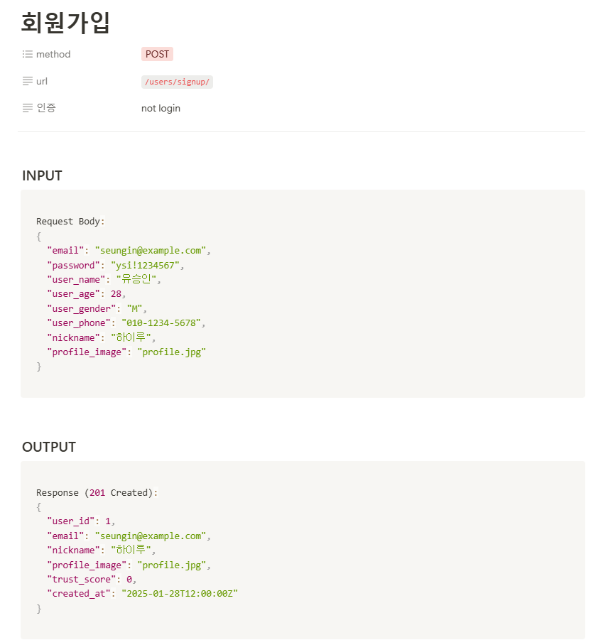

## 🎯핵심 키워드

---

### Restful API

우선 Restful의 Rest란 무엇인가?

Rest: 자원을 이름(자원의 표현)으로 구분해 해당 자원의 상태(정보)를 주고 받는 모든 것을 의미함.

즉,자원(resource)의 표현(representation)에 의한 상태 전달을 뜻한다.

REST는 기본적으로 웹의 기존 기술과 HTTP 프로토콜을 그대로 활용하기 때문에, 웹의 장점을 최대한 활용할 수 있는 아키텍처 스타일로, 네트워크 상에서 Client와 Server 사이의 통신 방식으로

어떤 자원에 대해 CRUD(Create, Read, Update, Delete) 연산을 수행하기 위해 URI(Resource)로

GET, POST 등의 방식(Method)을 사용하여 요청을 보내며, 요청을 위한 자원은 특정한 형태(Representation of Resource)로 표현됨

- **자원** **:** 해당 소프트웨어가 관리하는 모든 것 ( 문서, 그림, 데이터, 해당 소프트웨어 자체 등 )

  ex) 자원을 구별하는 ID는 `/orders/order_id/1` 와 같은 HTTP URI 이다.

- **표현 :** 그 자원을 표현하기 위한 이름 ( DB의 학생 정보가 자원이면, 'students'를 자원의 표현으로 정함 ) ⇒ 현재는 JSON으로 주고 받는 것이 대부분
- **상태 전달 :** 데이터가 요청되는 시점에 자원의 상태를 전달한다. ( JSON 혹은 XML을 통해 데이터를 주고 받는 것이 일반적 )
- 행위: HTTP 프로토콜의 Method를 사용한다. HTTP 프로토콜은 `GET`, `POST`, `PUT`, `DELETE`와 같은 메서드를 제공한다.

그렇다면 이러한 Rest 개념을 바탕으로 한 Restful API는?

RESTful API는 **REST의 원칙을 따르는 API**를 의미함.

즉, **HTTP 메서드와 URL을 사용하여 자원을 표현하는 방식**

### **RESTful API의 특징**

1. **클라이언트-서버 구조**
    - 클라이언트(예: React, iOS 앱)와 서버(Django, Spring Boot)가 분리되어 있음.
    - 서버는 데이터 제공, 클라이언트는 UI를 담당.
2. **무상태(Stateless)**
    - 서버는 요청을 받을 때마다 **이전 요청 정보를 기억하지 않음.**
    - 즉, 요청마다 **완전한 정보**를 포함해야 함. (ex. 로그인 시 매번 `Authorization` 헤더 필요)
3. **캐시 가능(Cacheable)**
    - GET 요청의 응답은 캐시 가능 → 성능 최적화 가능
4. **계층 구조(Layered System)**
    - 클라이언트는 직접 데이터베이스에 접근할 수 없음.
    - 서버 → 비즈니스 로직 → 데이터베이스가 계층적으로 분리됨.
5. **일관된 인터페이스(Uniform Interface)**
    - HTTP 표준 메서드(`GET`, `POST`, `PUT`, `DELETE`)를 사용하여 데이터를 다룸.
    - URI는 명확한 리소스를 나타내야 함. (ex. `/users/1` → ID가 1인 사용자)

개념은 알겠는데 그렇다면 이걸 왜 쓰는것인가 궁금해서 찾아봤더니

- RESTful APIs 개발하는 가장 큰 이유는 **Client Side를 정형화된 플랫폼이 아닌 모바일, PC, 어플리케이션 등 플랫폼에 제약을 두지 않는 것을 목표로 했기 때문 입니다.**
- 즉, 2010년 이전만 해도 Server Side에서 데이터를 전달해주는 Client 프로그램의 대상은 PC 브라우저로 그 대상이 명확 했다. 그렇다 보니 그냥 JSP ASP PHP 등을 잉요한 웹페이지를 구성하고 작업을 진행하면 됐다.
- 하지만 스마트 기기들이 등장하면서 TV, 스마트 폰, 테블릿 등 Client 프로그램이 다양화 되고 그에 맞춰 Server를 일일이 만다는 것이 꽤 비효율적인 일이 되어 버렸다.
- 이런 과정에서 개발자들은 Client Side를 전혀 고려하지 않고 메시지 기반, XML, JSON과 같은 **Client에서 바로 객체로 치환 가능한 형태의 데이터 통신을 지향하게 되면서 Server와 Client의 역할을 분리하게 되었다.**

그러니까 결국 RESTful API는 다양한 플랫폼과 클라이언트가 동일한 방식으로 서버와 통신할 수 있도록 표준화하여 확장성과 호환성을 높이기 위해 사용된다. 라고 설명하면 될 것 같다!

이렇게 본다면 되게 장점들만 있는것 같은데 그래서 단점도 한번 알아본다면

### **REST의 단점들**

1. REST는 point-to-point 통신모델을 기본으로 한다. 따라서 서버와 클라이언트가 연결을 맺고 상호작용해야하는 어플리케이션의 개발에는 적당하지 않다.
2. REST는 URI, HTTP 이용한 아키텍처링 방법에 대한 내용만을 담고 있다. 보안과 통신규약 정책 같은 것은 전혀다루지 않는다. 따라서 개발자는 통신과 정책에 대한 설계와 구현을 도맡아서 진행해야 한다.
3. HTTP에 상당히 의존적이다. REST는 설계 원리이기 때문에 HTTP와는 상관없이 다른 프로토콜에서도 구현할 수 있기는 하지만 자연스러운 개발이 힘들다. 다만 REST를 사용하는 이유가 대부분의 서비스가 웹으로 통합되는 상황이기에 큰 단점이 아니게 되었다.
4. CRUD 4가지 메소드만 제공한다. 대부분의 일들을 처리할 수 있지만, 4가지 메소드 만으로 처리하기엔 모호한 표현이 있다.

### API 명세서란?

정말 간단하게 말하자면 그냥 API 명세서는 서버와 클라이언트간 특정 기술을 사용하기 위한 약속!

⇒ 이해가 어렵다면 프론트엔드와 백엔드가 소통할 수 있는 방법이라고 생각해도 될것 같다.

API 명세서는 프로젝트를 진행할때 되게 중요한 파트인데

- **명확한 소통:** API 명세서를 통해 개발자 간의 소통이 원활해지고, API를 사용하는 외부 개발자도 이해하기 쉽게 도와줌.
- **일관성 유지:** 명세서를 통해 API 설계와 구현에서 일관성을 유지.
- **효율적인 유지보수:** 잘 작성된 명세서는 코드 수정 시 API의 영향을 쉽게 파악할 수 있게 도와줌.

위 예시들이 API 명세서의 중요성을 가장 잘 나타낸거 같아서 적어봤다.

API 명세서 작성의 주요 요소

사실 API 명세서는 정말 각 팀별로 프론트엔드와 백엔드의 원활한 소통이 가장 좋은 명세서지만,,, 기본적으로 작성되는 주요 요소들이 있기때문에 그것에 대해 살펴보면

### 1. 기본 정보

API 명세서의 첫 부분에는 다음과 같은 **기본 정보**가 포함되어야 함.

- **API 이름:** API의 이름과 간단한 설명.
- **버전:** API의 현재 버전 (예: v1, v2).
- **기본 URL:** API의 기본 URL (예: https://api.example.com/v1).

### 2. 인증 방법

API 사용 시 필요한 **인증 방식**을 명시

- **API 키 인증:** Authorization: Api-Key {API_KEY}
- **OAuth2:** Authorization: Bearer {ACCESS_TOKEN}
- **기타:** 예를 들어, Basic Auth 또는 JWT를 사용하는 경우 이를 명확히 설명한다.

### 3. 엔드포인트 및 HTTP 메서드

API 명세서의 핵심은 각 **엔드포인트**와 **HTTP 메서드이다.**

- **엔드포인트 URL:** (예: /users, /users/{id})
- **HTTP 메서드:** (예: GET, POST, PUT, DELETE)
- **설명:** 해당 엔드포인트의 기능과 목적에 대한 설명.

### 4. 요청 파라미터

각 엔드포인트에 대한 **요청 파라미터**를 설명한다.

- **경로 파라미터:** (예: {id} in /users/{id})
- **쿼리 파라미터:** (예: ?sort=asc)
- **헤더:** (예: Content-Type: application/json)
- **본문(body):** JSON 형식의 요청 데이터 예시.

### 5. 응답 구조

API가 반환하는 **응답 구조**를 명확히 설명한다:

- **응답 형식:** 주로 JSON 형식으로 설명.
- **상태 코드:** 200 OK, 201 Created, 404 Not Found 등.
- **응답 예시:** 실제 응답 데이터의 예시(JSON).

### 6. 오류 처리

API 사용 중 발생할 수 있는 **오류 상황**과 대응 방법을 명시한다:

- **상태 코드:** (예: 400 Bad Request, 401 Unauthorized, 500 Internal Server Error)
- **오류 메시지 형식:** 오류 발생 시 반환되는 JSON 메시지의 형식과 예시.

이러한 구성 요소를 따라 예전에 작성한 API 명세서의 예시를 살펴보면  

  

이러한 형식으로 작성을 했던 기억이 있다.