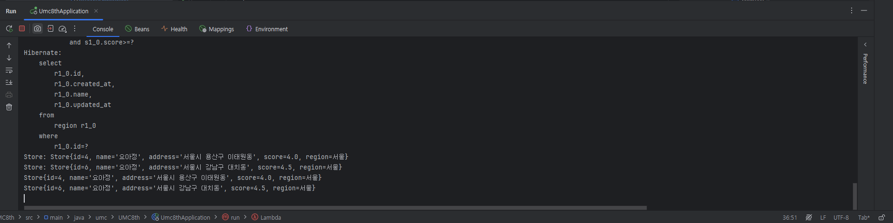

# 🎯핵심 키워드

---

## 1. 지연로딩과 즉시로딩의 차이
우선 지연로딩과 즉시로딩의 차이를 알아보려면 각각의 개념에 대해 알아보고 가야할것 같아서 알아봤다.

### 지연로딩이란?

**지연 로딩**은 객체나 데이터를 **실제로 필요할 때까지 로딩을 미루는 전략이다.**

즉, 연관된 객체나 컬렉션을 데이터베이스에서 **즉시 불러오지 않고**, 해당 객체가 실제로 사용되는 시점에 쿼리를 실행해서 로드함.
JPA에서 `@OneToMany`, `@ManyToOne`, `@OneToOne`, `@ManyToMany` 같은 **연관관계 매핑** 시, 지연 로딩은 **기본 동작이거나 설정할 수 있는 전략**

```java
@Entity
public class Member {
    @Id
    private Long id;

    private String name;

    @ManyToOne(fetch = FetchType.LAZY)  // 기본적으로 LAZY를 지정
    private Team team;
}
```

이때 `member.getTeam()`을 호출하기 전까지는 `Team`에 대한 쿼리가 실행되지 않는다.

### **지연 로딩의 장단점**
| 장점                         | 단점                                      |
|----------------------------|-------------------------------------------|
| 초기 로딩 성능 향상         | 사용 시점에 쿼리 발생 가능성 (N+1 문제)   |
| 메모리 사용 최적화          | LazyInitializationException 발생 가능성   |
| 불필요한 데이터 로딩 방지   | 복잡한 쿼리로 이어질 수 있음             |


### 즉시 로딩 (Eager Loading)이란?

즉시 로딩은, 연관된 엔티티를 **엔티티를 로딩하는 순간 바로 함께 로딩하는 전략이다**.

**즉시 조인**해서 함께 데이터를 가져오며, **프록시 객체를 사용하지 않음.**
```java
@Entity
public class Member {
    @Id
    private Long id;

    private String name;

    @ManyToOne(fetch = FetchType.EAGER) // 아까와 다르게 즉시 로딩 실행 
    private Team team;
}
```

### 즉시 로딩의 문제점은?

1.  **모든 상황에서 JOIN 쿼리가 발생**

2.  **N+1 문제 더 심각해짐**
3. **쿼리 튜닝이 어려워짐 등이 있음.**

그렇다면 이러한 지연로딩과 즉시로딩의 차이점을 알아보자.

| 항목           | 지연 로딩 (LAZY)                  | 즉시 로딩 (EAGER)                         |
|----------------|-----------------------------------|-------------------------------------------|
| 로딩 시점      | 실제로 사용할 때                   | 엔티티 조회 시 바로                       |
| 장점           | 성능 최적화, 메모리 절약           | 사용 편의성 (즉시 접근 가능)             |
| 단점           | LazyInitializationException, N+1 발생 가능 | 불필요한 조인, 성능 저하           |
| 구현 방식      | 프록시 객체 사용                   | 즉시 JOIN 실행                            |
| 사용 추천      | 대부분의 연관 관계에서 권장         | 단일 필수 관계일 때 제한적으로 사용       |

이러한 지연로딩과 즉시로딩을 언제 적절하게 사용하는가 살펴보면

| 상황                                 | 권장 방식                                  |
|--------------------------------------|--------------------------------------------|
| 거의 대부분의 관계                   | `FetchType.LAZY` 사용                       |
| 필수 단방향 관계 (ex. 주문 → 회원)   | `EAGER` 고려 가능 (주의해서)               |
| 다대일(`@ManyToOne`) or 일대일(`@OneToOne`) | 반드시 `LAZY`로 명시 설정 필요        |
| 다대다, 일대다                        | 기본 `LAZY`, 반드시 유지                   |

결론적으로는

1. **지연 로딩을 기본으로 사용하고, 필요한 경우에만 즉시 로딩을 명시적으로 사용**

2. 지연 로딩은 반드시 트랜잭션 내에서 접근

3. **즉시 로딩은 남용하면 성능 문제를 유발하므로 주의**

등을 사용

## 2. Fetch Join
### Fetch Join 이란?

**Fetch Join**은 **JPQL에서 연관된 엔티티를 함께 조회하는 방법으로,**

보통 **지연 로딩**으로 설정된 연관 관계를, **쿼리 한 번으로 같이 가져오도록 강제**하는 기능임

⇒ 즉, 지연 로딩 상태지만 필요한 순간 한방 쿼리로 가져오는 전략

```sql
SELECT m FROM Member m JOIN FETCH m.team
```

- 일반 JOIN과 달리, **FETCH** 키워드를 사용해서 실제 엔티티를 **즉시 로딩**함.
- **m.team이 LAZY여도, 즉시 로딩됨** (쿼리 한 번으로 해결)

### 일반 JOIN vs FETCH JOIN

| 항목         | 일반 JOIN                          | FETCH JOIN                                |
|--------------|-------------------------------------|--------------------------------------------|
| 목적         | 조인 조건                           | 연관 엔티티 로딩                           |
| 대상         | 조건 필터링                         | 실제 객체를 즉시 로딩                      |
| 결과         | 엔티티 X, 데이터만 JOIN             | 연관 엔티티까지 로딩됨                    |
| 사용 시점    | 조건이 필요할 때                    | 연관 객체 로딩이 필요할 때                |

이러한 FETCH JOIN의 장점으로는 N+1 문제 해결, 쿼리 최적화 등이 있고, 단점으로는 일대다 시 중복, 페이징 불가 등이 존재한다.

그래서 보통 이러한 Fetch join은  다대일 연관 조회에서 사용하고, 일대다 연관 조회에서는 Fetch join 사용을 주의해야한다고 한다. 이러한 일대다 연관 조회에서는 Fetch join 보다 DTO 사용을 권장 함.

## 3. @EntityGraph

- Fetch Join을 더 활용적이고 선언적으로 사용할 수 있는 강력한 도구가 바로 @EntityGraph라고 하는데

  ### 이러한 @EntityGraph란?

  @EntityGraph는 JPA가 제공하는 기능으로, **연관된 엔티티를 Fetch Join처럼 한 번의 쿼리로 함께 로딩**

  하기 위한 방법이다. **JPQL을 직접 쓰지 않고**, **간단한 선언**으로 Fetch Join의 효과를 낼 수 있음.

  이러한 @EntityGraph를 언제 쓰는것인가?

    - `findById`, `findAll` 같이 Spring Data JPA의 **자동 쿼리 메서드**를 쓸 때
    - **쿼리를 직접 작성하지 않고**, 연관 엔티티를 로딩하고 싶을 때
    - **N+1 문제를 해결하면서 코드도 깔끔하게 유지**하고 싶을 때

  보통 사용할때는 단일 연관 관계 로딩 → 메서드에 직접 사용 하는식으로 사용한다.

  ### 전통 JPQL과의 차이점
| 항목                 | 전통 JPQL (`@Query` + fetch join) | `@EntityGraph`                           |
|----------------------|------------------------------------|-------------------------------------------|
| 복잡한 쿼리 작성     | 직접 JPQL 작성 필요                | 선언만 하면 됨                             |
| 재사용성             | 재사용 어려움                      | 그래프 재사용 가능 (`@NamedEntityGraph`)  |
| 쿼리 가독성          | 낮음                               | 코드 가독성 높음                           |

하지만 이러한 `@EntityGraph`도 결국은 Fetch Join → **일대다에서는 중복 및 페이징 문제 있음**

중첩된 관계에서는 `NamedEntityGraph`가 필요함, 잘못 사용하면 JPA 쿼리 캐시 전략과 충돌할 수 있다.

## 4. JPQL

### JPQL 이란?

JPQL (Java Persistence Query Language) 은 객체(Entity)를 대상으로 하는 쿼리 언어이다.

- SQL처럼 **데이터베이스 테이블이 아니라**, **JPA 엔티티 객체**를 대상으로 질의함
- 데이터베이스 독립적이므로 **DBMS 벤더에 상관없이 동작**
- JPA의 ORM(Object Relational Mapping) 철학에 맞춘 쿼리 언어

그렇다면 이러한 JPQL과 SQL의 차이점은?

### SQL vs JPQL
| 비교 항목        | SQL                                | JPQL                                  |
|------------------|-------------------------------------|----------------------------------------|
| 대상             | 테이블, 컬럼                         | 엔티티, 필드                           |
| 반환 타입        | `ResultSet` (row/column)            | 엔티티, 필드, DTO                      |
| DB 종속성        | DBMS마다 다름                        | DB 독립적                              |
| 정적 분석        | 안 됨                               | 일부 가능 (IDE, 컴파일 시점)          |

JPQL의 구성요소로는 SELECT 절, FROM 절, JOIN 절이 있고,

- SELECT 절: **엔티티 전체**, **필드 일부**, **DTO 생성** 모두 가능
- FROM 절:  반드시 **엔티티 이름**을 사용해야 함 (테이블 이름 X)
- JOIN 절: 엔티티 간 연관 관계를 바탕으로 조인 가능


### JPQL 정리
| 특성         | 설명                                              |
|--------------|---------------------------------------------------|
| 객체 지향     | 테이블이 아닌, 엔티티 기반으로 탐색               |
| 추상화       | SQL을 추상화한 계층                               |
| 독립성       | DBMS에 종속되지 않음                              |
| 연관 탐색     | 객체 그래프 기반 탐색 가능                        |
| 선언형       | 복잡한 SQL보다 명시적이고 안전한 코드 작성 가능    |

결론적으로 JPQL은 객체를 SQL로 변환하는 언어로, SQL처럼 보이지만, 객체지향의 세계에서 동작하는 개념임.  이런 JPQL은 연관관계를 조인하는 게 아니라, 객체 간의 참조를 탐색하는 것이다.

## 5. QueryDSL

## QueryDSL 이란?

QueryDSL은 자바 코드로 작성하는 타입 안전한 JPQL 쿼리 언어임.

- **타입 안전(type-safe)**: 컴파일 타임에 필드, 조건, 반환 타입을 모두 검사
- **정적 언어 기반 DSL (도메인 특화 언어)**
- **JPQL의 추상화 + 자바 코드로 쿼리 작성**
- SQL이 아니라, **엔티티 기반 쿼리를 자바 언어로 표시**

**즉, 객체지향적 쿼리 작성을 코드로 표현하자**

- JPQL은 문자열이라 컴파일 타임 검사가 불가능 → 오타가 나도 런타임에 터짐
- QueryDSL은 모든 쿼리를 **정적 타입으로 검증할 수 있는 자바 코드로 표현**

JPQL은 객체를 대상으로 하는 SQL이고, QueryDSL은 객체를 대상으로 하는 Java 코드 쿼리 언어다.


## JPQL vs QueryDSL

| 항목           | JPQL                             | QueryDSL                                |
|----------------|----------------------------------|------------------------------------------|
| 문법           | 문자열 기반                       | 자바 코드 기반                           |
| 오타 검증       | 런타임에 검증                    | 컴파일 타임에 검증                       |
| 자동 완성       | 불가                             | IDE 자동완성 가능                        |
| 리팩토링 대응   | 취약                             | 강력한 타입 기반 리팩토링 지원           |
| 복잡한 쿼리     | 점점 힘듦                         | 유연한 쿼리 구성 가능                    |

### 그렇다면 이러한 QueryDSL을 사용하는 이유는?

1. 타입안정성: 모든 쿼리 요소를 컴파일 타임에 검증
2. 재사용성: 동적 조건 쿼리 조립 가능
3. 가독성: IDE 자동완성으로 가독성과 생산성 향상
4. 객체지향 쿼리: 도메인 엔티티 기반 쿼리
5. 유지보수: 리팩토링에 매우 강함 (필드 이름 변경시 컴파일 오류로 탐지 가능)

등이 있다.

## 6. N+1 문제를 해결할 수 있는 여러 가지 방법들

저번 키워드에서도 정리했지만 N+1 문제란?

- 어떤 엔티티 **N개**를 조회했는데, 그에 따라 연관된 엔티티를 **N번 추가 쿼리**해서 결국 **1 + N번의 쿼리**가 발생하는 문제.
- 대표적인 케이스는 `@OneToMany` 또는 `@ManyToOne` 연관관계에서 **지연 로딩(LAZY)** 전략이 기본일 때 자주 나타난다.

그렇다면 **이러한 N+1 문제를 해결할 수 있는 방법**들에 대해서 알아보자

1. **Fetch Join (JPQL에서 `join fetch` 사용)**
```java
@Query("SELECT m FROM Member m JOIN FETCH m.orders")
List<Member> findAllWithOrders();
```
- **장점**: 단 1번의 쿼리로 `Member`와 `Order` 모두 조회.
- **단점**: 여러 연관관계를 fetch join하면 **데이터 중복** 또는 **카티션 곱** 발생 가능.
- **주의**: 페이징 불가 (ToMany 조인 시)

2. @EntityGraph 사용
```java
@EntityGraph(attributePaths = {"orders"})
@Query("SELECT m FROM Member m")
List<Member> findAllWithOrders();
```
- `@EntityGraph`는 **JPQL 그대로 유지**하면서 특정 연관 필드만 **즉시 로딩(EAGER)** 하도록 지정.
- **장점**: 페이징과 함께 사용 가능 (`ToOne` 관계에 한정).
- **단점**: 여러 필드 지정 시 복잡해질 수 있음.

3. Batch Size 설정
```YAML
spring:
  jpa:
    properties:
      hibernate.default_batch_fetch_size: 100
```

- **동일한 지연 로딩 필드**가 있을 때, **IN 쿼리**를 이용해 묶어서 한번에 가져옴.
- **장점**: LAZY 유지하면서도 성능 개선.
- **단점**: 모든 연관 필드에 일괄 적용되며 튜닝이 필요함.

4. DTO 직접 조회
```java
@Query("SELECT new com.example.dto.MemberDto(m.id, m.name, o.name) FROM Member m JOIN m.orders o")
List<MemberDto> findMemberWithOrder();
```
- DB에서 필요한 필드만 조회해서 DTO로 직접 반환.
- **장점**: 쿼리 효율 최고. JOIN 및 페이징 완벽히 가능.
- **단점**: 재사용성 떨어지고, 코드 중복 발생 가능.

5. QueryDSL Fetch Join + Projection 사용
```java
/*
return queryFactory
    .select(Projections.constructor(MemberDto.class,
        member.id, member.name, order.name))
    .from(member)
    .join(member.orders, order).fetchJoin()
    .fetch();
*/

```
- **QueryDSL**에서는 타입 안정성 + 복잡한 동적 쿼리까지 조합 가능.
- DTO Projection과 Fetch Join을 함께 활용해 성능과 구조 모두 개선.


# ☑️실습 인증


