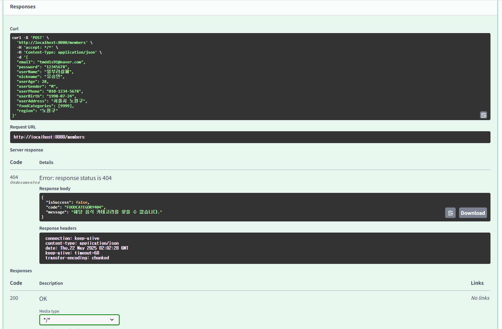

# 🎯핵심키워드

---

# 1. java의 Exception 종류들


## 1. Checked Exception (확인된 예외)

- 컴파일 타임에 예외 처리를 **반드시 강제하는 예**
- 예외가 발생할 수 있는 메서드에서는 `throws`로 선언하거나, `try-catch`로 잡아야 함
- 주로 **외부 자원** (파일, DB, 네트워크 등)과 관련된 예외가 많음

### 대표적인 클래스들

| 예외 클래스               | 설명                             |
|--------------------------|----------------------------------|
| `IOException`            | 입출력 오류 (파일, 스트림 등)   |
| `SQLException`           | 데이터베이스 접근 오류           |
| `ParseException`         | 날짜나 포맷 파싱 실패            |
| `ClassNotFoundException` | 클래스가 없을 때                 |
| `InterruptedException`   | 스레드가 인터럽트 되었을 때      |

```java
public void readFile(String path) throws IOException {
    BufferedReader reader = new BufferedReader(new FileReader(path));
    String line = reader.readLine();
    reader.close();
}
```
예시 코드의 메서드는 호출한 쪽에서 반드시 IOException을 처리해야 한다.

### Checked Exception 처리 방식

### 1. `try-catch`로 예외 처리

```java
/*
try {
    FileReader reader = new FileReader("test.txt");
} catch (FileNotFoundException e) {
    System.out.println("파일을 찾을 수 없습니다.");
}
 */
```

### 2. throws로 예외 전가

```java
public void readFile() throws IOException {
    FileReader reader = new FileReader("test.txt");
}
```

### 언제 Checked Exception을 설계에 쓰는가?

### 사용 적합:

- 복구 가능한 예외일 때 (예: 연결 실패 → 재시도 가능)
- 외부 시스템과 통신하는 API

### 피해야 할 때:

- 프로그래밍 오류 (널 참조, 배열 범위 초과 등) → Unchecked가 더 적절
- 지나치게 많으면 코드가 `try-catch`로 난잡해질 수 있음

## 2. Unchecked Exception (확인되지 않은 예외)

- 컴파일러가 **예외 처리를 강제하지 않음**
- 주로 **개발자의 실수** 또는 **논리적 오류**로 인해 발생
- `RuntimeException`을 상속받은 클래스들이 해당됨
- 즉, `throws` 선언도, `try-catch`도 **필수 아님**

그래서 “확인되지 않은 예외” = **컴파일러가 확인하지 않는 예외**

### 대표적인 클래스들

| 예외 클래스                      | 설명                             |
|----------------------------------|----------------------------------|
| `NullPointerException`          | 널 객체 참조 시                  |
| `ArrayIndexOutOfBoundsException`| 배열 인덱스 초과                 |
| `IllegalArgumentException`      | 부적절한 인자 전달               |
| `ClassCastException`            | 잘못된 형변환                    |
| `ArithmeticException`           | 0으로 나누기 등 수학 오류        |

### 예시 코드

```java
public void divide(int a, int b) {
    int result = a / b;  // b가 0이면 ArithmeticException
}
```

위 예시 코드는 try-catch 하지 않아도 컴파일은 되지만, 실행 시 예외가 터짐

### Unchecked Exception의 장단점은?

### 장점

- **코드가 간결**해짐
- **매번 예외 처리 강요하지 않아**도 됨
- 특히 **프로그래밍 오류**를 처리할 때 유리함

  (예: null 체크, 인자 검증은 개발자가 사전에 해야 할 의무)


### 단점

- 예외 처리를 하지 않으면 **런타임에 애플리케이션이 죽음**
- 숨겨진 버그 발생 가능성 증가
- 책임이 **개발자에게 100% 존재**

## 3. Error (에러)

- **JVM 레벨의 심각한 문제**를 나타냄
- 일반적으로 **개발자가 처리해서는 안 됨**
- 주로 메모리 부족, 스택 오버플로우 등 복구 불가능한 상황
- `Throwable`의 하위 클래스지만, `Exception`과는 다름.
- **JVM 자체나 시스템 자원 수준의 오류**를 표현
- 일반적으로 **복구 불가능 (Non-recoverable)** 하다고 간주
- 대부분은 개발자 실수도 아니고, 비즈니스 로직 오류도 아님 → **JVM이나 환경의 상태가 문제**

### 대표적인 클래스들

| 예외명                        | 설명                                                    |
|-------------------------------|---------------------------------------------------------|
| `OutOfMemoryError`           | 힙 메모리 부족. 메모리 누수, 큰 배열, 무한 캐시 등      |
| `StackOverflowError`         | 재귀 호출이 너무 깊어 스택이 넘침                      |
| `NoClassDefFoundError`       | 컴파일은 됐지만 런타임에 클래스 파일을 찾을 수 없음     |
| `UnsatisfiedLinkError`       | native 라이브러리 (JNI) 로드 실패                       |
| `ExceptionInInitializerError`| static 블록 초기화 실패                                 |
| `VirtualMachineError`        | JVM 자체 오류 (OOM, StackOverflow 포함)                 |
| `InternalError`              | JVM 내부적으로 알 수 없는 문제가 발생                   |


### 예시 코드
```java
public void causeStackOverflow() {
    causeStackOverflow();  // 무한 재귀 호출로 StackOverflowError
}
```
위 예시 코드는 무한 재귀 호출로 StackOverflowError가 발생함.

### 간단한 결론은:

- **Checked Exception**은 **예측 가능**한 문제 → 반드시 처리
- **Unchecked Exception**은 **논리 오류**나 **검증 부족** → 방어적 코딩 필요
- **Error**는 그냥 두자... JVM이 처리하거나 죽어야 하는 상황

# 2. @Valid

## `@Valid`는 무엇인가?

- **Bean Validation** 스펙에서 제공하는 **표준 어노테이션**
- 컨트롤러, 서비스, 혹은 다른 레이어에서 **객체 검증(Validation)** 을 트리거함
- `@Valid` 는 Java Bean Validation API (JSR-303 / JSR-380)에서 제공하는 **표준 어노테이션**
- 주요 목적은: **이 객체 안에 있는 필드들을 제약 조건(Constraint)에 따라 검증해라**
- 실제 검사는 객체 내부의 어노테이션들 (`@NotNull`, `@Size`, `@Email` 등)을 트리거해서 수행

⇒ Spring은 Bean Validation API의 **구현체**를 통해 이 기능을 수행

### @Valid의 작동흐름:

@RequestBody @Valid UserDto → 컨트롤러 진입 전에 HandlerAdapter → Validator 호출 → Constraint 위반 체크 → 예외 발생

```java
@PostMapping("/users")
public ResponseEntity<?> createUser(@RequestBody @Valid UserRequest request) {
    // UserRequest 내 필드에 @NotNull, @Size 등이 있으면 검증됨
}
```

@Valid는 단순히 "이 객체를 검증해봐" 라고 지시하고 ⇒ 실제 검증 대상은 해당 객체의 필드에 붙은 제약 조건 어노테이션들이다.

### 커스텀 어노테이션과의 차이
| 항목      | `@Valid`                               | 커스텀 어노테이션                             |
|-----------|-----------------------------------------|------------------------------------------------|
| 제공 주체 | 표준 라이브러리 (javax/jakarta)         | 개발자 직접 정의                               |
| 목적      | Bean Validation 시작 트리거             | 비즈니스 로직, 권한, 검증 등 다양              |
| 범위      | 주로 Request DTO 검증                   | 전 범위 (메서드, 필드, 클래스 등)              |
| 조합      | 다른 제약 조건(@NotNull, @Size)과 함께 사용 | 필요시 Validator or AOP와 조합                  |

### @Valid의 장점 

| 장점       | 설명                                         |
|------------|----------------------------------------------|
| 선언적 검증 | 코드가 깔끔해짐                              |
| 자동화     | 컨트롤러 진입 전에 검증                      |
| 재사용성   | 여러 DTO, 서비스에서 반복 가능               |
| 표준화     | JSR 스펙 기반 → 구현체 교체 가능              |
| 확장성     | 커스텀 제약조건 만들기 가능                   |

# 3. 커스텀 어노테이션
## 커스텀 어노테이션이란?

### 정의

Java의 `@interface` 키워드를 사용하여 **개발자가 직접 만든 어노테이션**

```java
@Target(ElementType.METHOD)
@Retention(RetentionPolicy.RUNTIME)
public @interface CheckMission {
}
```
Spring AOP나 BeanPostProcessor, HandlerInterceptor 등과 결합하여 강력한 기능을 제공함. 

## 왜 커스텀 어노테이션을 쓰는가?

### 목적: **관심사의 분리**

**일반적**
```java
@GetMapping("/missions/4/try")
public ResponseEntity<?> tryMission(User user) {
    if (missionService.isInProgress(user)) {
        throw new MissionInProgressException();
    }
    return missionService.startMission(user);
}
```
**커스텀 어노테이션 사용:**
```java
@CheckMissionInProgress
@GetMapping("/missions/4/try")
public ResponseEntity<?> tryMission(User user) {
    return missionService.startMission(user);
}
```
커스텀 어노테이션을 사용하여 비즈니스 검증 로직이 추상화되고, 핵심 로직이 깔끔하게 보인다.
또한 반복되는 검증 로직을 재사용 가능하고, 유지보수와 테스트가 쉬움

## 커스텀 어노테이션의 구성 요소별 설명
| 구성 요소                   | 설명                                                        |
|----------------------------|-------------------------------------------------------------|
| `@Target`                 | 어노테이션이 적용될 위치 (METHOD, FIELD, TYPE 등)           |
| `@Retention`              | 언제까지 어노테이션 정보를 유지할지 (RUNTIME이 AOP에 필수)  |
| `@Aspect`                 | 어노테이션을 감지하고 동작을 정의하는 AOP 클래스            |
| `JoinPoint`              | 대상 메서드, 파라미터 등에 접근할 수 있는 정보              |
| `@Around`, `@Before`, `@After` | 언제 끼어들지 정의하는 Advice                              |

## 커스텀 어노테이션이 자주 쓰이는 곳
| 영역           | 사용 예                                            |
|----------------|---------------------------------------------------|
| 인증/인가      | `@LoginUser`, `@CheckToken`                       |
| 중복 방지      | `@NoRepeatSubmit`, `@CheckMissionInProgress`      |
| 권한 처리      | `@AdminOnly`, `@Permission("ROLE_USER")`          |
| 공통 검증      | `@ValidateEmailUnique`, `@CheckMissionState`      |
| 트랜잭션/로깅  | `@Transactional`, `@LogExecutionTime`              |

### 결론: 커스텀 어노테이션은 메타데이터 + AOP로 비즈니스 로직 분리하고, 주로 공통 로직이 반복될 때, 선언적으로 처리할 때 사용하고, 재사용성, 가독성, 유지보수성 향상의 장점이 있기 때문에 사용한다. 

# 4. Swagger
## Swagger 란?

Swagger는 RESTful API를 정의하고 문서화하기 위한 프레임워크이며, OpenAPI Specification(OAS)의 초기 이름이다.

- 즉, **Swagger는 OpenAPI를 표현하고 관리하는 툴셋**
- 현재는 OpenAPI라는 이름이 공식이고, Swagger는 이를 구현한 대표 도구 브랜드임

## Swagger 구성 요소

| 구성요소              | 설명                                                                 |
|-----------------------|----------------------------------------------------------------------|
| Swagger UI            | API 명세를 웹 브라우저에서 예쁘고 직관적으로 보여주는 인터페이스       |
| Swagger Editor        | YAML/JSON 기반 API 명세(OpenAPI)를 작성하고 테스트할 수 있는 웹 에디터 |
| Swagger Codegen       | API 명세로부터 서버/클라이언트 코드 자동 생성                         |
| Swagger Core          | Java 등에서 Swagger 명세를 만들기 위한 라이브러리                     |
| Springdoc/OpenAPI     | Spring에서 Swagger를 쉽게 연동하기 위한 라이브러리 (→ Spring Boot에서 주로 사용됨) |


**그렇다면 개발할때 Swagger는 정말 흔하게 많이 사용하고 있는데, 왜 사용하는걸까?**

## Swagger를 쓰는 이유

### 1. API 문서 자동화

- 코드 주석으로 작성된 정보로부터 자동으로 Swagger UI가 생성됨
- 실시간으로 변경 사항 반영

### 2. 클라이언트와의 계약

- API의 입력/출력 구조를 명확히 정의
- **API 소비자 (프론트엔드, 앱, 외부 파트너)** 가 서버 없이도 API를 이해하고 개발 가능

### 3. 테스트 및 Try 기능

- UI 상에서 실제 API를 호출하고 결과를 확인 가능
- 테스트 자동화 전에 **수동 확인이 쉬움**

### 4. 코드 생성 가능

- Swagger Codegen을 통해 서버 스텁, 클라이언트 라이브러리를 자동 생성할 수 있음

### 5. 개발 간소화

- API 스펙 문서와 서버 구현이 **동기화 상태 유지**
- 문서와 실제 구현이 불일치하는 문제 감소

### Spring Boot에서 Swagger 사용 예시
```groovy
implementation 'org.springdoc:springdoc-openapi-starter-webmvc-ui:2.2.0'
```

대표 라이브러리: **springdoc-openapi-ui 의존성 추가**

Swagger UI 자동 경로: [**http://localhost:8080/swagger-ui.html**](http://localhost:8080/swagger-ui.html)

```java
@RestController
@RequestMapping("/users")
@Tag(name = "User API", description = "사용자 관련 API")
public class UserController {

    @Operation(summary = "사용자 조회", description = "ID로 사용자 정보를 가져옵니다")
    @ApiResponse(responseCode = "200", description = "성공")
    @GetMapping("/{id}")
    public UserDto getUser(@PathVariable Long id) {
        return userService.getUser(id);
    }
}
```

1. `springdoc-openapi` 라이브러리가 애플리케이션을 구동할 때
2. `@RestController`, `@RequestMapping`, `@GetMapping`, `@Operation`, `@Tag` 등 어노테이션을 스캔하고
3. 내부적으로 OpenAPI (Swagger) 스펙 객체를 생성함 (JSON 형태)
4. 이걸 **Swagger UI**가 읽어서 브라우저에서 시각화함

⇒ 즉, 해당 코드는 **Swagger UI가 읽을 수 있는 OpenAPI 문서를 자동으로 만들어주는 기반이 되는 코드**

### 최종 정리
| 키워드             | 설명                                                           |
|--------------------|----------------------------------------------------------------|
| Swagger            | OpenAPI 명세를 시각화/자동화하기 위한 도구                   |
| 핵심 역할          | 문서화, 시각화, 자동화, 테스트                                  |
| 주요 구성          | Swagger UI, Swagger Editor, Codegen                           |
| Spring에서 사용    | `springdoc-openapi-ui` + 컨트롤러 어노테이션                  |
| 왜 쓰는가?         | API 개발을 명세 기반으로 바꾸기 위함 (계약 중심 개발)             |


# ☑️실습 인증



