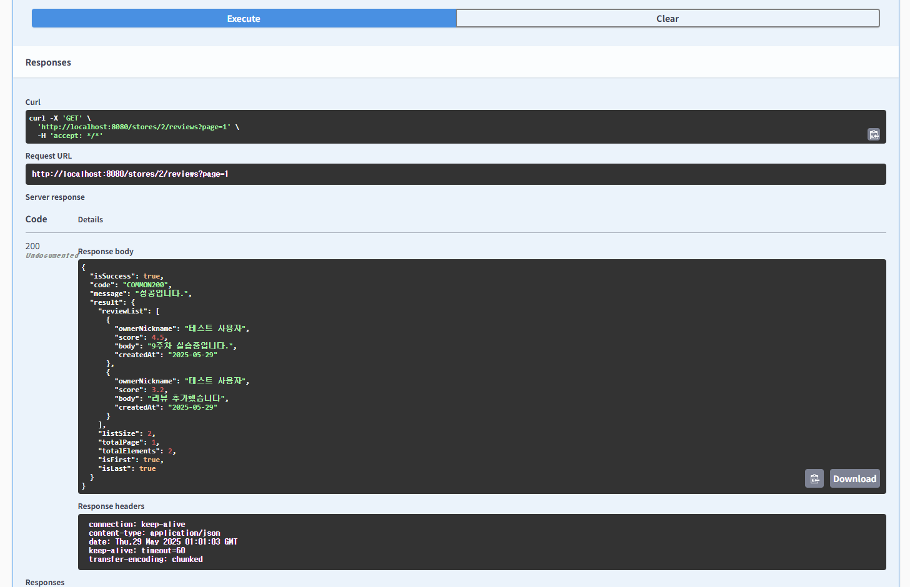

# 🎯핵심키워드

---

# 1. Spring Data JPA의 Paging

### 페이징(Paging)이란?

대량의 데이터를 일정한 크기로 나눠서 요청하고 처리할 수 있게 해주는 기능

- 예를 들어 전체 데이터가 1000개일 때, 한 번에 모두 불러오는 것이 아니라:
    - 1페이지에 10개씩
    - 총 100페이지 중 1~3페이지만 로딩
- 이는 **메모리 효율성**, **데이터 응답 속도**, **사용자 경험** 측면에서 필수 기능이다.

Spring Data JPA는 다음 두 가지 페이징 결과 타입을 지원함

| 인터페이스 | 설명 |
|------------|------|
| `Page<T>`  | 전체 데이터 개수(count 쿼리 포함)와 함께 결과 반환 |
| `Slice<T>` | 다음 페이지 존재 여부만 판단, 전체 개수는 안 구함 |

### Page<**T**> vs Slice<**T**>

| 항목              | `Page<T>`                                 | `Slice<T>`                          |
|-------------------|--------------------------------------------|-------------------------------------|
| 전체 개수 조회    | `count()` 실행                             | 실행 안 함                          |
| 성능              | 상대적으로 느림 (특히 대용량 DB)           | 빠름                                |
| `hasNext`         | O                                          | X                                   |
| `getTotalElements`| O                                          | X                                   |
| `getTotalPages`   | O                                          | X                                   |
| 사용 예시         | 관리자 페이지, 전체 페이지 수가 필요한 목록 | 무한 스크롤, 더보기 UI 등           |

## 1-1 Page
### 정의

`org.springframework.data.domain.Page<T>`

페이지의 데이터 목록, 전체 개수, 현재 페이지 정보, 총 페이지 수 등을 포함하는 완전한 페이징 결과

### 특징
| 항목                         | 설명                                                                 |
|------------------------------|----------------------------------------------------------------------|
| `count(*)` 실행              | 총 데이터 개수 계산 (`SELECT COUNT` 쿼리 자동 실행됨)                |
| 마지막 페이지 여부 확인 가능 | `page.getTotalPages()`, `page.isLast()` 등으로 확인 가능              |
| 정렬, 페이지, 크기 정보 포함 | `Pageable` 사용하여 정렬, 페이지 번호, 크기 등 정보 포함 가능         |
| 클라이언트에 전체 페이지 정보를 제공해야 할 때 유리 | 전체 페이지 수 및 총 데이터 수를 제공해야 하는 UI에 적합 |

Page는 전체 데이터 + 페이지 정보 포함하며 count 쿼리를 자동 실행하고 DTO로 반환 시 PageMetadata 함께 전달 가능하다. (상대적으로 무거움)

### Page 구성 요소 (실습 및 미션에서 사용한것들도 있음)

| 메서드                        | 설명                                                        |
|------------------------------|-------------------------------------------------------------|
| `getContent()`               | 실제 데이터 (`List<T>`) 반환                                 |
| `getTotalElements()`        | 전체 데이터 개수 (`SELECT COUNT` 쿼리 결과)                 |
| `getTotalPages()`           | 전체 페이지 수 (총 개수 ÷ 페이지 크기)                      |
| `getNumber()`               | 현재 페이지 번호 (0부터 시작)                               |
| `getSize()`                 | 페이지 크기                                                 |
| `isFirst()` / `isLast()`    | 첫/마지막 페이지 여부                                       |
| `hasNext()` / `hasPrevious()` | 다음/이전 페이지 존재 여부                                 |

### 동작 원리

1. `Pageable` 객체가 컨트롤러 파라미터로 주입됨
    - 페이지 번호, 크기, 정렬 정보 포함
2. Spring Data JPA는 `LIMIT`, `OFFSET`, `ORDER BY`를 자동으로 생성
3. 동시에 **`SELECT COUNT(*)` 쿼리도 별도로 수행**해서 전체 개수 계산
4. 그 결과를 `PageImpl<T>` 객체로 감싸서 반환

### Page<**T**>의 장점

| 항목                   | 설명                                                                 |
|------------------------|----------------------------------------------------------------------|
| 풍부한 메타 정보       | 페이지네이션 UI 구현에 필요한 모든 정보 제공                         |
| 클라이언트와 명확한 계약 | 전체 개수, 현재 페이지, 마지막 여부 등 프론트에서 쉽게 처리 가능        |
| DTO 변환 용이          | `.map()`을 이용한 변환 간편                                          |
| REST API 설계에 적합   | `Page<T>` 그대로 반환해도 클라이언트가 파싱 가능                      |

하지만 Page<T>는 무조건 COUNT 쿼리를 수행하기 때문에, 데이터량이 많고, 조인이 많으면 이 COUNT 쿼리 때문에 성능이 급격히 저하될 수 있음

## 1-2 Slice

### 정의

`org.springframework.data.domain.Slice<T>`

Page보다 가벼운 형태의 페이징 결과. 전체 개수는 모르고, 다음 페이지가 존재하는지만 판단 가능

### 특징 요약

| 항목                             | 설명                                                                 |
|----------------------------------|----------------------------------------------------------------------|
| `count(*)` 안 함                | → 성능 부담 적음 (특히 대용량 DB에서 유리)                          |
| 다음 페이지 존재 여부 제공      | `hasNext()`                                                          |
| 전체 페이지 수, 총 개수 제공 안 함 | → `getTotalPages()`, `getTotalElements()` 없음                        |
| "무한 스크롤", "더보기" UI에 적합 | UX적으로도 빠름                                                     |

Slice는 다음 페이지 여부만 알 수 있고 count 쿼리는 실행하지 않고 DTO로 반환 시 Content + hasNext만 전달 가능하다. (상대적으로 가벼움)

Slice의 개념을 쉽게 설명하면 **전체 데이터 개수**는 알 수 없지만, **“다음 페이지가 있는지” 여부만 판단**

할 수 있도록 설계된 **가벼운 페이징 도구임.**

### Slice 구성요소

| 메서드         | 설명                     |
|----------------|--------------------------|
| `getContent()` | 데이터 목록               |
| `getNumber()`  | 현재 페이지 번호          |
| `getSize()`    | 요청한 페이지 크기        |
| `hasNext()`    | 다음 페이지 존재 여부     |
| `isFirst()`    | 첫 페이지 여부            |
| `getSort()`    | 정렬 정보                 |

### Slice가 왜 필요한가 하면

- `Page<T>`는 항상 `count()` 쿼리를 수행 → 조인 많은 쿼리에서는 **매우 느릴 수 있음**
- `Slice<T>`는 count 쿼리를 생략하고, 다음 페이지 판단만 하기 때문에 **빠르다**
- 요즘 UI 트렌드가 “더보기”, “스크롤 시 자동 로딩” 등 이기때문에

  → 이런 인터랙션에는 전체 개수보다 `hasNext()`가 훨씬 중요함 (UX 개선)

---

# 2. 객체 그래프 탐색

### 정의

도메인 객체(Entity) 간의 연관 관계를 따라가며 다른 객체에 접근하는 행위를 의미한다.

- 즉, A 엔티티가 B를 참조하고 있을 때, `A.getB().getC().getName()`처럼 연결된 관계를 **객체 그래프를 따라 탐색(navigation)** 하는 것.

### 관련 용어

| 용어          | 설명                                                              |
|---------------|-------------------------------------------------------------------|
| 객체 (`Object`) | 메모리 상의 엔티티 인스턴스                                       |
| 그래프 (`Graph`) | 객체 간 연관 관계를 표현하는 구조 (ex: 연관 필드들)               |
| 탐색 (`Navigation`) | 객체의 필드를 따라 다른 객체에 접근하는 과정                     |

그래서 객체 그래프 탐색은 ⇒  **도메인 객체 간의 관계를 따라가며 객체 내부를 순회하거나 조회하는 것**

객체 그래프 탐색을 하다보면 한 번 조회로 N개의 엔티티를 가져온 후, 각각의 연관 객체를 가져오기 위해 또 다른 쿼리가 N번 수행되는 문제인 N+1 문제가 발생할 수 있음.

### 객체 그래프 탐색 시 고려할 사항

| 고려 요소                  | 설명                                                                 |
|----------------------------|----------------------------------------------------------------------|
| 연관 객체의 로딩 시점      | Lazy or Eager?                                                       |
| 탐색 깊이                  | `A → B → C → D` → 탐색이 깊을수록 쿼리 많아짐                        |
| 탐색 경로에서의 성능 영향 | 중간 객체가 많으면 조인/쿼리 복잡도 증가                              |
| 컬렉션 연관 탐색 시        | 컬렉션은 특히 N+1 문제에 민감함                                      |
| DTO 변환                   | 탐색 시 Entity → DTO 변환 시 지연 로딩에 유의                         |

## 결론

| 항목        | 설명                                                              |
|-------------|-------------------------------------------------------------------|
| 정의        | 객체 간의 연관 필드를 통해 다른 객체로 접근하는 행위              |
| 목적        | 도메인 모델 내에서 자연스럽게 연관 객체 탐색                      |
| 핵심 개념   | 연관관계 + 로딩 전략이 핵심                                        |
| 주요 이슈   | 지연 로딩, N+1 문제, 성능 저하                                     |
| 해결 전략   | `fetch join`, `EntityGraph`, DTO 분리 등을 활용한 성능 최적화       |

지연 로딩된 객체 탐색 시, JSON으로 반환할 때 문제가 생길 수 있음: 무한 루프, `LazyInitializationException` 등

이러한 문제들을 해결하기 위해 DTO로 변환하여 컨트롤러에서 반환, `fetch join` 사용하여 미리 로딩하기 등의 방법들을 주로 사용하여 객체 그래프 탐색의 문제를 해결한다.

---

# ☑️실습 인증

