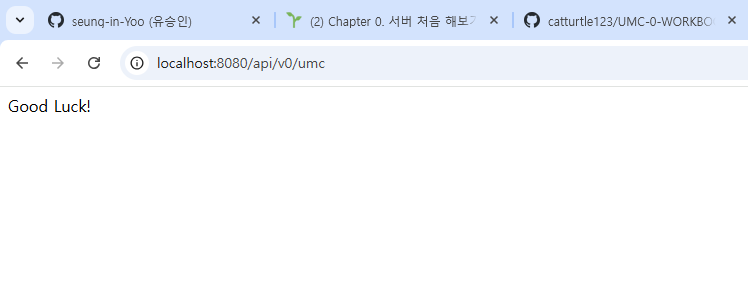

## 🔥 미션

---
### 1. 너디너리 홈페이지 접속하는 과정 적어보기 (소켓프로그래밍과 같은 개념 없이 TCP, IP, PORT 등의 개념 등 오늘 배운 내용으로 간단하게 적어주세요)

사용자가 웹 브라우저에 너디너리 홈페이지의 URL을 입력 ⇒ https://demoday.neordinary.co.kr/
    
사용자가 입력한 URL에서 도메인 이름( https://demoday.neordinary.co.kr/)을 **DNS(Domain Name System)** 서버에 요청하여 **IP 주소**를 찾음.
    
**DNS 서버에 요청하여 IP 주소를 찾을때는 DNS 서버**가 네트워크 상에서 도메인 이름을 대응하는 IP 주소로 바꿔주고, 이 IP 주소를 웹 브라우저로 반환
    
**바꾼 IP 주소**를 통해 웹 서버와 통신을 시작하고, **TCP 연결**을 설정하기 위해 **3-way handshake** 
진행
    
**TCP 연결**이 성공적으로 이루어진 후, 브라우저는 **HTTP** 프로토콜을 사용해 웹 서버에 요청
    
웹 서버는 요청을 받아 **HTML 페이지**나 **이미지** 등의 데이터를 **HTTP 응답**으로 브라우저에 반환
    
**4-way handshake를 통하여 TCP 연결**을 종료
    
간단하게 요약하면
    
1. **사용자가 URL 입력 → DNS 서버에서 IP 주소 변환**
2. **브라우저는 TCP 연결을 통해 서버와 연결**
3. **HTTP 요청을 보내고, 서버는 HTTP 응답을 반환**
4. **브라우저는 HTML을 렌더링하여 웹 페이지 표시**
5. **TCP 연결 종료**

### 2. 깃허브 clone 받아서 실행하고 나온 페이지 스크린 샷 찍기 

