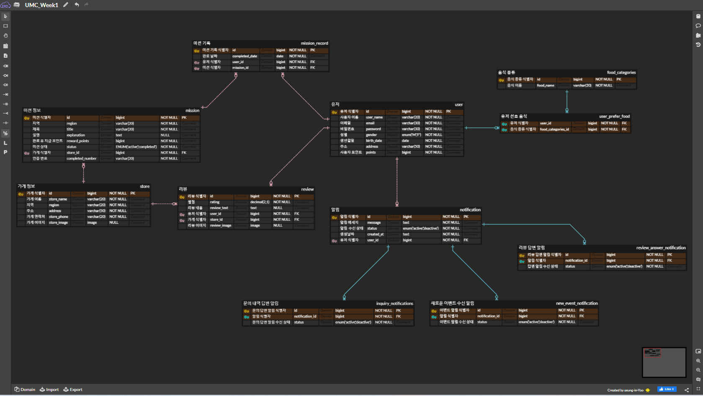

## 🔥미션

---

1. 주어진 IA(기획 플로우)와 와이어 프레임(디자인 프로토타입)을 보고 직접 데이터베이스를 설계해오기, 위에서 언급한 경우를 다 적용해서 할 것
2. 이름 글자 수 등 세부적인 부분은 원하는 대로 해도 됨!
3. 각 지역 별로 가게들이 있으며 가게를 방문하는 미션을 해결하며 포인트를 모으는 서비스
    1. 모든 지역마다 10개의 미션 클리어시 1000 point 부여로 고정

**최소한 로그인/회원가입, 미션, 홈 화면에 필요한 데이터는 설계를 해야함, 되어있지 않다면 원 아웃**

***미션 난이도 완화를 위해 지도 검색 기능 전부 pass, 저 부분은 설계 하지 마세요***

***내 포인트 관리, 알 부분도 설계하지 마세요***

***사장님이 자신의 점포 관리하는 부분도 설계 대상에서 제외입니다.***

물론 원하시면 하셔도 됩니다. 😉

