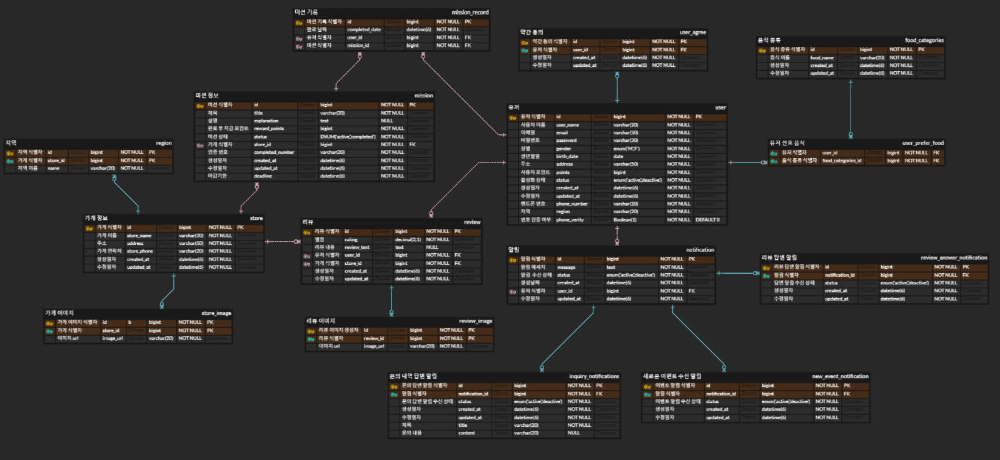

## 🔥미션

---

### 1주차 때 설계한 데이터베이스를 토대로 아래의 화면에 대한 쿼리를 작성

#### ✅스터디 및 피드백을 기반으로 수정한 ERD✅

<br><br>

### ERD 바탕으로 쿼리문 작성

1. **내가 진행중, 진행 완료한 미션 모아서 보는 쿼리**

```sql
SELECT
    mr.mission_id,
    m.title AS mission_name,
    m.status AS mission_status,
    m.reward_points AS points_earned
    mr.completed_date
FROM
    mission_record AS mr -- 미션 기록 테이블 별칭 지정
JOIN 
    mission AS m ON mr.mission_id = m.id -- 미션 테이블 별칭 지정 및 id를 통하여 조인
WHERE
    mr.user_id = 1 -- 유저 아이디 입력 (현재는 예시로 1로 두고 진행)
ORDER BY
    mr.completed_date DESC, mr.mission_id ASC -- 가장 최근에 완료된 미션이 먼저 표시되도록 내림차순 정렬, mission_id는 오름차순으로 정렬
LIMIT 15 OFFSET 0; -- 페이징 처리하기 (한번에 최대 15개)
```

2. **리뷰 작성하는 쿼리**
```sql
INSERT INTO review (
    user_id,
    store_id,
    review_text,
    rating,
    created_at
) VALUES (
    1, -- 예시로 사용자 아이디 입력
    5, -- 가게 ID 입력
    '내부가 깔끔하고 음식이 맛있어요!.', -- 리뷰 내용 입력
    4.5, -- 평점 입력 (0.0 ~ 5.0)
    NOW() -- 현재 시간 자동 입력
);
```

3. **홈 화면 쿼리 (현재 선택 된 지역에서 도전이 가능한 미션 목록, 페이징 포함)**
```sql
SELECT
    m.id AS mission_id,
    m.title AS mission_name,
    m.reward_points,
    m.deadline AS mission_deadline,
    s.store_name AS store_name,
    s.address AS store_address,
    u.points AS user_points, -- user 테이블의 사용자 포인트도 가져와야함
    r.name AS region_name -- 맨 위 화면에 나타나는 지역을 표시하기 위해 가져옴
FROM
    mission AS m
JOIN
    store AS s ON m.store_id = s.id -- 미션과 가게 정보 연결
JOIN 
    region AS r ON s.id = r.store_id -- 가게와 지역 연결
JOIN
    user AS u ON u.id = 1 -- 특정 user ID를 통해서 조인
WHERE
    r.name = '안암동' -- 선택한 지역 (예시로 사진처럼 안암동)
  AND
    m.status = 'active' -- 활성화된 미션만 조회
ORDER BY
    m.deadline ASC -- 마감일 기준으로 오름차순 정렬 (가까운 순서)
LIMIT 15 OFFSET 0; -- 페이징 처리 (최대 15개)
```

4. **마이 페이지 화면 쿼리**
```sql
-- 사용자의 정보 및 포인트, 리뷰에 관한 쿼리
SELECT
    u.id AS user_id,
    u.user_name AS user_nickname,
    u.email AS user_email,
    u.phone_number AS user_phone_number,
    u.phone_verity AS user_phone_verity,
    u.points AS user_points, -- 현재 유저의 포인트
    SUM(m.reward_points) AS total_points_earned, -- 미션 완료 후 지급되는 포인트의 총 합계
    COUNT(r.id) AS total_review_write -- 지금까지 작성한 리뷰수를 알기위해 리뷰 식별자를 count
FROM
    user AS u
LEFT JOIN
    mission_record AS mr ON u.id = mr.user_id AND mr.completed_date IS NOT NULL -- 미션을 완료한 경우한 포함시킴
LEFT JOIN
    mission AS m ON mr.mission_id = m.id
LEFT JOIN
    review AS r ON u.id = r.user_id
WHERE
    u.id = 1 -- 유저 id 입력
GROUP BY
    u.id;

-- 1:1 문의 목록 조회에 관한 쿼리
SELECT
    inq.id AS inquiry_id,
    inq.notification_id,
    inq.title AS inquiry_title,
    inq.content AS inquiry_content,
    inq.created_at AS inquiry_created_at
FROM
    inquiry_notifications AS inq
WHERE
    inq.user_id = 1 // 유저 ID 입력
ORDER BY
    inq.created_at DESC; -- 생성일자 기준으로 최신순 정렬 

-- 알림 설정에 관한 쿼리
SELECT
    n.id AS notification_id,
    n.message AS notification_message,
    n.status AS notification_status,
    n.created_at AS notification_created_at,
    n.updated_at AS notification_updated_at
FROM
    notification AS n
WHERE
    n.user_id = 1 -- 유저 ID 입력
ORDER BY
    n.created_at DESC; 
```
