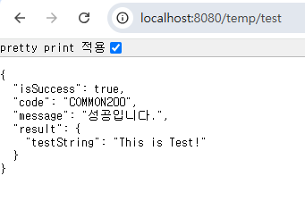
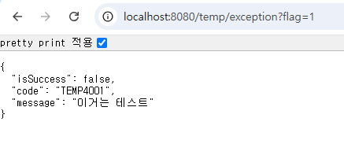
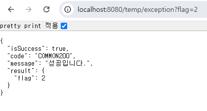

# 🔥 미션

---

## 미션 진행 시 중간 과정 인증샷

--- 

---

---

## RestContollerAdvice의 장점과 불편한점 

### 장점
1. 예외 처리의 중앙 집중화
   @RestControllerAdvice는 여러 컨트롤러에서 발생하는 예외를 한 곳에서 관리할 수 있게 해준다.
   - 컨트롤러마다 반복되는 try-catch 제거
   - 예외 유형별로 공통적인 대응 가능 
   - 모든 예외 흐름이 한 파일에서 관리 → 관심사의 분리 실현

2. REST 응답 일관성 보장
@RestControllerAdvice를 사용하면 어떤 예외든 json 형식의 약속된 구조를 통해 자동으로 응답할 수 있다.
   - 즉, JSON 구조를 통일함으로써 프론트와의 계약 및 소통을 안정화시킬수 있음.

3. 유효성 검사 예외 자동 처리 가능
Spring에서 @Valid, @Validated로 입력값 검증을 할 때 
MethodArgumentNotValidException, ConstraintViolationException 같은 예외가 발생하는데,
이것 또한 @RestControllerAdvice에서 자동으로 처리가 가능하다.

4. 테스트 용이성 증가
컨트롤러는 순수 비즈니스 로직만 포함하고 예외 처리는 Advice에서 하기 때문에 단위 테스트도 훨씬 쉬워지고, 가독성도 좋아짐.

5. 로깅 및 감시 일원화
   모든 예외가 한 곳에서 처리되므로, log.error()도 찍기때문에 중앙 로그 시스템에서 추적도 쉬워짐.

### 불편한점
1. 처리되지 않은 예외가 빠져나갈 수 있음
   예외를 직접 명시해주지 않으면, Advice에서 캐치가 되지않음.
   - @ExceptionHandler(UserNotFoundException.class)을 쓰지않으면 UserNotFoundException은 Advice에서 처리되지 않고 그대로 500으로 빠져서 서버 에러가 발생함.

2. 예외 세분화 설계 필요 (설계가 복잡해짐)
BusinessException, ValidationException, NotFoundException, ConflictException 등, 예외를 설계하려면 도메인마다 수십 개가 될 수 있음.
   - 잘못하면 예외 클래스가 난립하거나, 처리 메서드가 너무 길어짐.

3. 필요 이상으로 잡아버리는 경우
간혹 불필요하게 모든 예외를 Advice에서 잡아버리면, 오히려 디버깅이 어려워질 수 있음.
   - 이런 경우는 진짜 예외 로그가 사라져버려서 문제 해결이 늦어짐

4. 상태 코드(HttpStatus) 관리 어려움
모든 예외 응답이 200 OK 로 나가는 경우가 있을수 있음. => (ApiResponse 자체는 정상 응답으로 간주되기 때문)
   - 이런 경우 프론트 입장에서는 서버가 정상 처리한 것처럼 보여 혼란을 초래함.

    
    